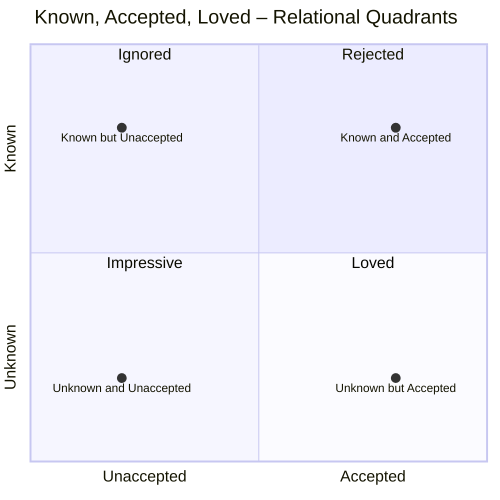

# PARTS OF THIS WEBPAGE

- [ ] Overview
- [ ] Sermon Outline
- [ ] Slides
- [ ] Atonement Theories Comparison Table
- [ ] Tensions but possible integration

## Overview

#### The Cross as Deliverance

#### Main Scripture
**Colossians 1:19-20 (NIV)**  
> "God was pleased to have all his fullness dwell in Jesus, and through him to reconcile to himself all things, whether things on earth or things in heaven, by making peace through his blood, shed on the cross."

#### Additional Scripture
- **Mark 14:12–15**  
- **1 Corinthians 5:7**  
- **Exodus 12:46 / John 19:36**  
- **Exodus 12:22 / John 19:28–29**  
- **Exodus 12:12 / Colossians 1:16**  
- **Exodus 12:13 / Romans 5:9**  
- **Luke 22:14–15**  
- **Exodus 3:7**  
- **John 2:24–25 (NRSV)**  
- **Romans 5:6, 8**  
- **1 Corinthians 11:23–26**

---

#### Quotes

> "To be a Christian is to believe that God became man and suffered a death as terrible as any mortal has ever suffered. This is why the cross, that ancient implement of torture, remains what it has always been: the fitting symbol of the Christian revolution. It is the audacity of it—the audacity of finding in a twisted and defeated corpse the glory of the creator of the universe—that serves to explain, more surely than anything else, the sheer strangeness of Christianity, and of the civilization to which it gave birth. Today, the power of this strangeness remains as alive as it has ever been."  
> — *Tom Holland*

> "Jesus’ death has been construed from the very earliest moments of the Christian church as the new Passover, and his resurrection as the new exodus... [but] this time, instead of intervening from on high as in the exodus, the intervention has taken place from within God's own life, in the form of the Son's self-offering."  
> — *Fleming Rutledge, The Crucifixion*

> "I can only be fully loved if I am fully known."  
> — *John Ortberg*

## Sermon Outline

##### The Passover Lamb: Fully Known, Fully Loved  
_Text: [Mark 14:12–15](https://www.biblegateway.com/passage/?search=Mark+14%3A12-15&version=NIV)_

##### I. Gathering, Welcome, and Framing

- Call to awareness of God’s nearness in both “mountaintop” and low places.  
- Reflection on where God has been present in the past week (work, home, friendships).  
- Prayer of thanks for new life through Jesus’ life, cross, and resurrection.  
- Welcome to newcomers and those curious about the Christian faith.  
- Announcements: Ash Wednesday worship night, Lenten journey, Revelation Bible lecture, invitation to connect via the Westgate app.  
- Giving as worship: prayer to resist the “delusion of riches” and grow in generosity.

##### II. Scripture Reading: Setting the Scene

- Reading of [Mark 14:12–15](https://www.biblegateway.com/passage/?search=Mark+14%3A12-15&version=NIV).  
- Context: Festival of Unleavened Bread, customary sacrifice of the Passover lamb.  
- Disciples ask where to prepare the Passover; Jesus sends two with specific instructions.  
- Note: This Passover meal occurs less than 24 hours before Jesus’ arrest and crucifixion.

##### III. The Cross from Above: Dalí and St. John of the Cross

- Introduction of Salvador Dalí’s “The Christ of Saint John of the Cross.”  
- Childhood memory of seeing this disorienting angle—viewing the cross from above.  
- Origin in a 16th‑century sketch by St. John of the Cross, drawn from a prison vision.  
- Vision described as seeing the crucifixion from God’s perspective “up in heaven.”  
- [[#Dali Christ On The Cross|Slide Link Lower In Deck]]

##### IV. Symbolism: Trinity, Time, and the Center of History

- Triangular shape (cross beams and Christ’s body) symbolizing the Trinity.  
- Circular framing symbolizing all time and space.  
- Claim: Christ’s death is the central moment holding all history and the cosmos together.  
- For 2,000 years Christians have regarded the cross as central to human history and creation.

##### V. Atonement: “At‑One‑Ment” with God and Others

- Definition: Atonement as “at-one-ment” – being made at one with God and one another.  
- The cross reconciles and restores relational wholeness with God and people.  
- Example text: [Colossians 1:19–20](https://www.biblegateway.com/passage/?search=Colossians+1%3A19-20&version=NIV) – God reconciling “all things” through Jesus’ blood shed on the cross.  
- The cross presented as a unified and unifying work in Christian belief.

##### VI. Atonement Theories vs. Biblical Images

- Long history of debate over “atonement theory” in Christian theology.  
- Christians often argue trying to identify the single, correct explanation of the cross.  
- Reminder: We all bring our own perspectives and stories to the cross.  
- Need for God’s perspective rather than merely human opinions.  
- [[#Atonement Theories Comparison Table|Theo Generate Table At End]]

##### VII. A Mosaic of Atonement Images

- Scripture offers multiple images and metaphors for why Jesus had to die.  
- These images function together as a mosaic rather than competing theories.  
- Affirmed dimensions of the cross:  
  - Payment of the penalty for sin.  
  - Substitution in our place.  
  - Ransom from the consequences of sin.  
  - Victory over death and powers/principalities.  
- Conclusion: The crucifixion happened for all these reasons “and so much more.”

##### VIII. Purpose of the Series: Not Just Information

- Multi‑week journey toward Good Friday and Easter: “Why did Jesus die?”  
- Central practical question: “What does that mean for us—for me?”  
- Aim is not mere data but encounter with the cross’s power.  
- Hoped effects:  
  - Deepened gratitude.  
  - Reshaped vision of God, self, and the world.  
  - Christ’s love at the cross meeting guilt, shame, fear, striving, weariness, confusion.  

##### IX. Jesus and the Passover: Timing and Intention

- Return to [Mark 14:12–15](https://www.biblegateway.com/passage/?search=Mark+14%3A12-15&version=NIV): Passover context is emphasized.  
- Jesus dies during Passover—this timing is intentional, not incidental.  
- Paul’s declaration: “Christ, our Passover lamb, has been sacrificed” ([1 Corinthians 5:7](https://www.biblegateway.com/passage/?search=1+Corinthians+5%3A7&version=NIV)).  
- Question posed: What does it mean that Jesus is our Passover Lamb?

##### X. The Original Passover and Exodus

- Passover as central salvation story of the Jewish people.  
- Commemoration of the Exodus:  
  - Rescue from slavery in Egypt.  
  - Journey toward the Promised Land.  
- Ongoing Jewish practice:  
  - Week‑long Passover festival.  
  - Passover meal that begins the feast.  
  - Slaughter and eating of a lamb—the Passover lamb—among family and friends.  
- Purpose: Remember God’s rescue from slavery and His ongoing work of deliverance.

##### XI. Key Parallels: Passover Lamb and Christ

- Intent: Show how details of the original Passover reappear in Jesus’ crucifixion.

###### A. Unbroken Bones

- Passover instruction: “Do not break any of the bones” of the lamb ([Exodus 12:46](https://www.biblegateway.com/passage/?search=Exodus+12%3A46&version=NIV)).  
- Crucifixion narrative: Jesus’ bones are explicitly not broken (cf. [John 19:31–36](https://www.biblegateway.com/passage/?search=John+19%3A31-36&version=NIV)).  
- Apparent “random” detail becomes meaningful in light of Passover imagery.

###### B. Hyssop and Blood

- Passover ritual: Hyssop used to apply lamb’s blood to doorposts ([Exodus 12:22–23](https://www.biblegateway.com/passage/?search=Exodus+12%3A22-23&version=NIV)).  
- Crucifixion: Jesus given sour wine on a sponge attached to a hyssop stalk ([John 19:28–29](https://www.biblegateway.com/passage/?search=John+19%3A28-29&version=NIV)).  
- Again, a seemingly minor detail that echoes Exodus.

###### C. Firstborn and Judgment

- Passover: God strikes down every firstborn in Egypt ([Exodus 12:29](https://www.biblegateway.com/passage/?search=Exodus+12%3A29&version=NIV)).  
- Christ: described as “the firstborn over all creation” ([Colossians 1:15](https://www.biblegateway.com/passage/?search=Colossians+1%3A15&version=NIV)).  
- Picture of judgment and deliverance converging in the Firstborn Son.

###### D. Blood that Saves from Destruction

- Passover promise: When God sees the blood, He “passes over”—no destructive plague ([Exodus 12:13](https://www.biblegateway.com/passage/?search=Exodus+12%3A13&version=NIV)).  
- Cross: We are “justified by His blood” and “saved” through Him ([Romans 5:9–10](https://www.biblegateway.com/passage/?search=Romans+5%3A9-10&version=NIV)).  
- Movement from slavery and death to freedom and life.

###### E. Jesus’ Eager Desire to Eat Passover

- [Luke 22:14–16](https://www.biblegateway.com/passage/?search=Luke+22%3A14-16&version=NIV): Jesus eagerly desires to eat this Passover before He suffers.  
- He does not desire torture; He is convinced His death will accomplish for all people what the first Passover did for Israel.  

##### XII. Historical Reality and Personal Implication

- Broad historical consensus:  
  - Jesus of Nazareth lived, was arrested, tried, and crucified under Rome.  
- Debate centers on whether He rose from the dead, not on whether He died.  
- Personal implication:  
  - Jesus died believing He was doing it “for you.”  
  - Even if one calls Him mistaken, the claim remains that He gave His life to rescue.  

##### XIII. Tom Holland on the Strange Power of the Cross

- Introduction of historian Tom Holland’s book *Dominion*.  
- Holland (not originally a Christian) argues that Christianity is central to human history.  
- Summary of his point on the cross:  
  - The cross, an instrument of torture, becomes the fitting symbol of the Christian revolution.  
  - The audacity: finding in a “twisted and defeated corpse” the glory of the Creator.  
  - This explains Christianity’s “strangeness” and its enduring civilizational impact.  
- Conclusion: Whatever we believe, the cross demands our attention.

##### XIV. The Danger of Familiarity with the Cross

- Many believers truly affirm the story but have grown numb to its power.  
- Cross imagery is everywhere (jewelry, décor, potential tattoos).  
- Confession of midlife “tattoo” musings as humorous example of cultural familiarity.  
- Warning: Familiarity can dull our hearts to the cross’s real power in mind, heart, and body.

##### XV. God’s Motivation in Exodus: Misery, Not Merit

- Return to [Exodus 3:7](https://www.biblegateway.com/passage/?search=Exodus+3%3A7&version=NIV):  
  - God sees misery, hears cries, is concerned about suffering.  
- Notably absent:  
  - No mention of Israel’s worthiness, devotion, or impressive faith.  
- Wilderness narrative shows Israel repeatedly failing and doubting.  
- Conclusion: God’s rescue flows from compassion toward sufferers, not the merit of the rescued.

##### XVI. Jesus as Passover Lamb for the Undeserving

- Parallel to Exodus:  
  - Jesus becomes our Passover Lamb because He sees our misery and enslavement to sin.  
- The power of the cross lies not in our deserving, but in God’s gracious love.  
- Jesus does not wait for us to gather enough faith or earn salvation.  
- He acts because we cannot save ourselves and He loves us too much to leave us enslaved.

##### XVII. The Quadrant of Being Known and Accepted

###### A. The Axes: Accepted vs. Unaccepted, Known vs. Unknown

- Visual framework:  
  - X‑axis: Unaccepted → Accepted.  
  - Y‑axis: Unknown → Known.  
- Every relationship (and our own self‑perception with God and others) falls into one quadrant.

###### B. Quadrant 1: Known but Unaccepted – Rejected

- When someone truly knows us and does not accept us, we experience rejection.  
- This is deeply painful, often associated with family of origin wounds.

###### C. Quadrant 2: Unknown and Unaccepted – Ignored

- Being both unknown and unaccepted leads to feeling invisible.  
- Jay’s story: multiple schools, moves, language barriers, loneliness, sense of invisibility.  
- Many in the congregation share similar feelings of being unseen and unwanted.  

###### D. Quadrant 3: Unknown but Accepted – Impressive

- Common in high‑achievement environments like Silicon Valley.  
- We keep our true selves hidden while carefully curating acceptance and admiration.  
- We feel impressive but remain unknown.  
- Jay confesses this as a personal temptation—even ministry can become a tool for acceptance.

###### E. Quadrant 4: Known and Accepted – Loved

- True love is to be fully known and fully accepted.  
- John Ortberg’s observation: “I can only be fully loved if I am fully known.”  
- All humans long to live in this quadrant: known, accepted, loved.

##### XVIII. How the Cross Addresses Our Deep Fears

- Many secretly believe that if God really knew them, He could not accept them.  
- Fears:  
  - Exposure of flaws, failures, addictions, secret motives.  
  - Assumption that God would be distant, disappointed, or disgusted.  
- The gospel response:  
  - Jesus already knows what is in us ([John 2:24–25](https://www.biblegateway.com/passage/?search=John+2%3A24-25&version=NIV)).  
  - “While we were still powerless” and “still sinners,” Christ died for us ([Romans 5:6–8](https://www.biblegateway.com/passage/?search=Romans+5%3A6-8&version=NIV)).  
- Therefore, in Christ, we are fully known and yet fully accepted—truly loved.

##### XIX. Identity in the Passover Lamb

- Because Jesus is our Passover Lamb:  
  - We are no longer defined by what enslaves us.  
  - Judgment has “passed over” us.  
- Cross‑shaped identity statements:  
  - You are fully known.  
  - You are fully accepted.  
  - You are fully loved.  
- Christ’s broken body and shed blood establish this new identity.

##### XX. Personalizing the Gospel

- Invitation to insert one’s own name into [Romans 5:6–8](https://www.biblegateway.com/passage/?search=Romans+5%3A6-8&version=NIV):  
  - “While I was still powerless, Christ died for me.”  
  - “God demonstrates His love for me in this: while I was still a sinner, Christ died for me.”  
- Exercise moves the cross from abstract concept to personal reality.

##### XXI. Invitation to Those Exploring Faith

- Address to those unsure if they have ever truly believed this to their core.  
- Key questions:  
  - Have I accepted that God fully knows me and fully accepts me because He loves me?  
  - Have I said “yes” to Jesus’ death and resurrection as God’s gift of love for me?  
- Practical step: after the gathering, come forward (Saratoga, South Hills, Redwood City) to:  
  - Share your story.  
  - Ask questions.  
  - Receive prayer.  
  - Explore what it means to say “yes” to Jesus and the cross.

##### XXII. Communion: Remembering the Passover Lamb

###### A. Preparation for the Table

- Transition to communion for followers of Jesus.  
- Call to pause, breathe, and re‑acquaint our hearts with the immense gift of the cross.  
- Reminder: Jesus died so that we might have life.

###### B. The Bread – Body Given for You

- Instructions to open the packet and take the wafer (bread).  
- Reading of [1 Corinthians 11:23–24](https://www.biblegateway.com/passage/?search=1+Corinthians+11%3A23-24&version=NIV):  
  - “This is my body, which is for you; do this in remembrance of me.”  
- Congregation receives the bread with gratitude.

###### C. The Cup – New Covenant in His Blood

- Instructions to carefully open the cup.  
- Reading of [1 Corinthians 11:25–26](https://www.biblegateway.com/passage/?search=1+Corinthians+11%3A25-26&version=NIV):  
  - “This cup is the new covenant in my blood… whenever you drink it, do it in remembrance of me.”  
- Emphasis: Blood represents life; communion proclaims the Lord’s death until He comes.  
- Congregation receives the cup with gratitude.

###### D. Worship in Response

- With “the life of the Passover Lamb pulsing through our veins,” the congregation stands (as able).  
- Corporate singing as an expression of gratitude to Christ for His sacrificial love.  

## Slides

### Dali Christ On The Cross

[[#III. The Cross from Above: Dalí and St. John of the Cross]] The Position In The Outline

![Image](data:image/webp;base64,UklGRihSAABXRUJQVlA4IBxSAAAwzgOdASo4BJYHPzmcxl0vP7+/onG5U/AnCWdu/7xnD2NlX//6+W30DyS9c1Auqd9XJdwn/R83jor9fx2/XeiIvBdKh3S+QzTBn9WJ/+8nGDf8+q3xJk366XkOtfYC//+j+cR/4P/8fTj8P/5fMn8N/qf/vQb+m///R7/Gf9vMP//eidNWEja5gRNPwijYQiB5Y0/CKNhCIHljT8Io07LfUnVvxJ63g9O/D5aysoVQPLQGIsZWPqKNsIRA8safhFGwc2JB9usu9HjtCK+PKcZjrQknx7kMF8cf6KddHVCOc6iWCXMUZlDpBgQtIZG3NjklTJr9J6W1U0RVbTbifTYYOHnJNhgTp+qNiXJ7Bni9OG2W//sOjpyOflviZ5WNuvT1jobB6bxzw306cUiBOme6ReRN3lzLl4RVkxWKCX6hlVjzaRFj6xAk64s1IPTrJuEgZG9O0WN3rG71jdaVk5WPfpIkCWKXoZdCQgXsCiuy4BeggIdHVJNG9MGLiSxXqqcdCAI+LpRfw/cUr0dowJ0YE6YvDNkWWl0t8HtwH6STlgQczUQIasGjd/KaDhTEeOeDdh7C4cyZDSDDt5ebsjYPcV6Ncq953jnDuY502Givw0JaMBjDizsFsE2IajomMLy+Le45t3CMLVl5UpS1Z0m+g4aQYd6oEVz+GJDtQ27H9OcVxKTqhFjgAxdosbqucLbJvZJ6aUA/0WzpI7wQtudplu8BZcJcA/Jvl0bCJ6dtlIoS7HGSPY31a7AKRAobBuDXesbvWNXTsgrRgV0V6y1CM7AmnZDxAscwgz+S8QclzrhXlULtFjd6xu9Y3esa+msh8ECpv93cGdb/Pcj9rPBdD+kjqsK2KaqK9FBqTjfSez0oS9VLJDpa1jBgdFr0TuxL7PYf1r+HbW4EKdFjk5S8RKI1LmDSNGflVdBHGWHxVxlzLeY4lmWrhlCAQfgG/W2Kn1142bMOAgBd55s38UiAxuJMf9/toJCtygaSvseBn2xWQ7afg67FO4Jam2yKLGx3WRKYQtwHf1ZywE6s9LLBX7xAMITyj/SwtEg7EDluQmYu2tow82IiyeCbK5DTMss5nJmdLCbnYuapyuSzlJr2dKkdbwbUIhwlkn8Nyou1B9Ne4XG7HmaTrFXtMApGRGqcy4ZNLnVx6qyNKiWSvLufJCvflLkCAjNb/XXOiPZZuYSC8LrEbe1rk7LDVRg8js5hgfQr9XAzHumVa1MIebsZq5UgRxrCaR694oVdLYDR/Ao6jHYPFzIpzeNZYyTGAm6UO0ad6n0V9ioiHZluw29k8i2GnHzg8uS6zAg/YKVWSDlmJUKbJAoMXO+UiLhAumPwIH+jlkLDr1Y2XBDXYVlWThO0XXMTNH0StPwinpaCPjBK36yn5Fbwy+0XlHPhrZOe91yFReVsXM3/NNh2Q4XaLEmw/jE38uEARAp4Bx9X62GNDghxa6B8k/OVGfH78ooAXxdEtQXLqkDgutJ7ncx9g30TpS9/I3O7BwFqZPqAOglePuI7IS6skRD4p1/2JVd4ASwAn5aHMCzIMTDaS1yWMYnRsRB8RFjkXxVvUQF1+JbFZjU/eMI+HwrLlQeNIcY0+FjCxJnOw/M8Y0CezbOd3i4GEEhv8J5BCOKPjmyan4knZRMQWKi7ovpVk2GCEWbuyEAHB0fMHSkiVOMB23Hi8cwFLK0o5gR6ZMF8xipN/LwGaWUk6YKw67lgY8MvVZBmzaiSnbm6A/2UjqiNmVr+YaDLCt+tAPq4D2CrQyMDElMt+ivdgmWv6pkRWFGhJOcSoUzPmLRs5+FaEQZJlMU6/FOJ0Rmsy6Bg06c6purSaJ4zSCjfwgSaBHJ5azyqwWpBFHj1a33czwxE6zLwAR9Ld1d0ADfmnwahj4fp0zrRXs7pyBqvXhlNUxbnwBMZuwSHni+rj3mKCgReqsWu6PATqDiJCJqj/JIqRSTbX0QzH96p9epPdc5HGAtdrKbGFUnnPKAwWmf0NuodiCoDLHEGRA9OhsbDRVcZ+ePF6YsFH9ZmLDGpsjzGJkOKl7egwC5M+1R/kkVHooE/bI9EnBoMTGvVZBxQKABNyR69Bzgox6tgzc5som+yrERt+f1AujnZksIMHkIMIpfoNZQsHd9hCIHd7jqeb6GuVjPNYIRZHVm6T9kFqLUt8gUdSW7gWhbcwNabm/HxAHaQ3geGzcwQofdERQyiXgsNAyuEM0cpSoy8lTzFlw2P1Na6ynWns/L781bHTQzxmzbpJzpdOThOfw+YF9+AL9TeRaKarS7LJDB9MKguuydbPAGK0kuJ6wY6zhp9zpcv1+/qe+Gy0WPm4bYICW+uCCofF8vavYy+vmBrqsZVgzRTWE44fLVKi3pQ9NRYtfypeCP/ciW1bs5JwZl5to3xfCX2rx8ZPBGynzyLgLMTWfZoBfYDJksVEq7CznAt1o+pRxfgBN6Pdrpkf5101aklDWRdoH4MgmisSV6ay6fRy8U4I+/FKhFMwM6CyRCJi3MuTKPXMXXGc9WinX4BhUUNil4d506cUiBOjvZ+V/mEouN0xGM1F98BmSVEbADk6eTFoh4aRsQ/dWZxRcJ+PI5E5MXw6coBrIxrEjmObpVQuoF6YP1YwF44/EAliWg/j3CsXrG9TBzto+txSIE6MCdGcrBTcP4kFaGZ6d1fiGX7W5pnrKidX97DVPElDcD07AFNxHvqjU6hXSNY1oQpWpsuGUChh434I1HFruY/I0Yt4E6MCdGBYEqu71jd5A4pEGZkPMBajHwQk+K4fygWcYNB7xwURqxRvZkDK9so0gCqgjn4hEGpmKaAAwYUK+lBVNUCV2fAmEE18iH/9scoLzP7yYh48bfnXjnMQjc4uPDb8ymc/LgyWQ9kdrtLrohHNaKhNDUO4tNSbG7ifhQYQnSKw7u5davLLT0IrrYkSH8CKzcM6sIc4oU7VCcN28+Bc9OWzWI50wN/1QnrfVElyEanRV1B2Bj/4mTThWusyy8N++Xvs6OBnzlCBhROnFIgTog4aNjgq7hp7P5pJxwlEL3E3VdySyuUktwgMeA5S83pWQvpfuzcF8Ggqbh0Uv9mGoALjYZX6SFa2iUrO7jWR/kDY7d32VdV93tdo0FND/KCym4TBsTqD+3J78UdqE28iXzEJNbfiI2vzCRD8ApP1PVED5hV2AeGynjlMyHzN2kZKUs82VK4gP0N69iBp+6hXhG+bh5KBAJABenTikQJ01J2Y58bE8zVdWJNhoS0YFflhKVuXbsSb5mum2/sdGT8dZogJP98Wfkk7os+rxb9s6BfyC8q+eIp4y+Adpk30f1oNm0pECdGBOjEGHEVmSj5NkQJ0YE6Z5OjAtVhipwMpUbwI+pOCuPj1GUEq3IbkrRon+lj7QxHV3qenXp04pECdGBOjAX2BUIzF6xu9Y3hGN3rDUOvY2EH3YMWPpTxw9wszxQHgxFZbvkOLCz38JQd7iLG71jd6ybIgTFs9Y4Xz4k2GBOjQlowK/li46qNs2wc8A7/y76l6bYgdPIriTYAFaAA5HBUX71jd6ybIgTowJ0XqY0pbKt9qYU4u0WnBIAEtn7cEsWyvTn8gLLPRpedUSjeOMjTMPUBECdGBOjAnRgTowJi2enTqhFjd6xu9Y+vWNX2DZ9lVoLThC4BRv7EgJX3nTPyG6tBKqQfANKXC7XesbvWN3rG71jd6xEhkp0YG64OGLY2f07bKQCv5ud64NL5AkL45UR7bCmtg7QVBsxecwmKhlAS2LqAJTDCLHLvGr9K8zAMlZkrG71jd6xu9Y3esbCUz95Y3l93qHBt16dQiVTaxL8e/yMSlTxRgIQ22iu4KOsPO3kHwEJkeAWEkB4ShIIF22F/3p6xu9Y3esbvWNgkDd67WTmk2GBOthKHBqMgn+8X0HeP8UNyZ24x9SakW7AOlyumB+k0rHip8eYoLNCOmO0QEUkVuzDLxycWv83esbvWN34mTYYE6L1MaTYeXzDfTpxSIE6MCXW4Li4M8mpN8qA0bFTwbPl5J1M18cEVDI4vZCiBppUlz2jo+BSY33uXkKUFOwBQPjbi6G1jcZUaa+fEmwl+MYYE6MCdGAvsAyN6dosbvWN3rG71SchVJ2FCOomibMCG60finoaGVavXmpyHRa7AhJhNzKpvYL8MewSz9VImYS4/1knstugvcL1O4iwU1O0WN3rJsiBOjAnRgL7AMjenaLG71jd6xu9vCAe9foT2eZmxA+bvZHOnxqARocI5m8yMTNgiFko3VcBxXPWoZUCck8XaMGDbrtWeLtFjX013rG71jd6xu9Y3esbrAKP1W9VuRVASkG9B3Z0u0QtI/yHtbS66qUFgrfZVvs8RQ7ikQJ0YgE8yL8g7dei/hdpjoQATox6gAbac+qwN0Xq/qPCi2HQAgeJajnA7lSYG0mqB+GCsbSb71ie/wDIAE6Q53DuPTgUiBOjAnRgTowJ0YLJRny9NAzIFhy2j8YvK5xKLcPAq8zTALlnG/FunZ+bLrg269OnFIgTowJ0XqY0mwwJ0S/AiLG71jd6lSSYeNHnkfmxHRO2TpYjfI76Y3JbHCLjXxeAETzIj7t9WuJmYoQRAnRgTovdzI+Dbr0TMiUODbr06cUiBOjAnRGiuIuw84pMIHbTkxJEOhhKFjLcMJZPlhIBLNZD/T/sKo1c2ChpQvZkABmzlSsbvWN16eFfZVvtDyQv83esbvWGxQxsNzMA1FtsswKHEAfBHA5/pGPWDjCz8dV4uE6qEyLkK4JgeznXp04gOkRuF2/6g74k2GBOjAnLtIPSbqK5LoxGCghSO/UD2XMH5cj4zDqhFjd64omACdGBOY0cxqkQKGypWN3rG71jdbRmSzMkBvg2kCd+5ampDoX4myw8V0u1+8sbvWN3rG71jd4wcusbvWTZuEocG3Xp04fI/ajOD3qxh7FYLV+nZak116dOqEWORMCdGBOi9TGzDikRjbtxRY3esbvWHzmADSCKEbzWCIxt3hJ9lW+yrfZVvspJjZhxSIII16dOKRAnRgVWtEfXJcknYwwJ0YFDw1oQOKRAnRJG8SbDAnRgTJ8G3Xp04hE4XjsC71nWn6jhfPiTYeIERY3esbvVEsOrf3JsMCdGBOjAnRgWXyODezBnofuKREGHKlY3esbvWN15hK0OKRAnRgTowJ0YE6KkPC+DZCA73RC8qdGBOjEGHBt16dOKQSN7pOvTpxTcJQ4NuvTpxV2Gl0dlDhhu9Y3eu1SIE6MCdGAvsCoRZ0r7LK3FI4gRFj68qMinBYS77lC6TYYG64S0LtFjd6xu8cAUWRuh6dpD2BEWN3rG72dtkbMmT96mAChsHDDd6xu9Y3eqIDr0YTtpiZNhgTowJ0YE62oXI0A+PShyvLgUNg269OneocEcyTRNlXKdGBOjAnRgTowU8pn+DXe4O6MQYcK98XaLG7yFsobnkPZNl6t9lX/vTpxSIE8ZyvktrkxNJ1+8sbvWN3rG7yBxQ3PIL8CP9xUS9xFjd6xvCcJMPerjwNwdxhRhwbdenTikPbUNygw7CPg4YbvWN3rG71jd457OVYpXQ0b07RY3esbvWN3sxhFEqu8eZ20WN3rG71jd6xuxCuN70zQ32Vb7Kt9lW+0PKoIixEgporg69Dbr06cUiBOjApN3652muSHp2ixu9Y3esbzPPvEDa7AsT07US71jd6y2NGBOjBcs+/gv7u9Y3esbvWN3rG71iTAmenTikxqRAnRgTowJ0YFZyb8J88Oq83NX2Vb7KuoyrfZVuksO/wSRAnRgTowJ1sJmb+FAPbGxvDFbwH1rmHaMCdpT28gRBxVcoLe21Y3esbvWWxo+QcHfReGEOwwYopVHbbjFfQRrIpEFOQJ2f03lLr3ZEObk2GBOn6QN00bB0+C7fg3qYtcjYAJItKRa7feCkRAnSHMc1ot0Vf+9OnFN/xi9qle8FK3FvgI3jC02SU3Qzd84ysikSkRA3AwAFPKUiIE6JocRgbdlPNzJ26XbdK5lVzCIiGSMQ9O0WN3rG78ZSk9Fe94CnaNGEDtbGsvB6IR2X7ExbGpA9j0jKXt1n5b6u2DXYcX69/RQ541vh7A/HvUmCyvGmNj2SN0s0PA4otqQUquEA6TAvPTi0v/ArcsGv5Ar+tCpNcyfw1nefBjlIgqC3AqfSZNEPTnFOUTvj3c4b1FulShYgBBmjzvxFBJvdcubD6XFyGDA9qxSIE6MC4MJiJP9uUgAW+9rzNnZUlnHcp1ptXee25/+/rIK47z9NoIrn8e3bAd+r7Ff0jjWYCCMWxYs0IFyIaoh4VvHDUgeTqirk0MkCTxjcca+s2Udwn7AJyim+c/LE8ybBzbZVZkvK1yhoGO+nFeUZapoFiWGBn6sDHrEHAI3SJmtOSiEQS4Dm61+UWVWq9StO9SqhLWOP0bR17BkUYjEmTCw8yoxUEZ4oz/NdU6lLMcdsAwqtyYZu1N5uHy9eGVYHLBvMrFWRGn228Fq+YarpgbKYouS28k8llsbETnzgr45OiSV4ziJW17eMbQh+QUTRf3kxwAvmf2+iXHfm3syjnjjst7NNuOgPlyKxVDz8RRe8kwXlSvsFbNjGsbYJYaeTAsLtq9aR/aGbuuxDM6CA114F4QDZqVVcwbQEFBXQTL8V9ZgROubciIJLqdluKIwtowHiQOxQLXZzpU9EEjgW1N0hv6BaIJXuAw7wwi7NHykt/QMRRasVs8/JP5XTAlXFOTfAl1/dTkr5D4q0Bg4egrBydq2B1gLnKgFj+UoTIpIoc2Co3bDU1TMrkO+ikzqaq0vKC66klhXavNnFQAM214AEFLvz0aLaFv76N4Hbc06cyEcaJ5R/prwlk+9BUYMyZy2RiSweQ8ASjLZDA+vbDeAwNa05SoIORczdfZwf6hvO8u/Hgeqd+5vVOdD0KFhaekDnl6+FQivkIRej3DNQsGtJ7JFNq1m918tO1x2p4m2rqJxwifq7idjOxlaZtBE/X2iLxGKvxj0+tQCHn2RJh0FShkNjtp/pnwQpXuThPt60DDuwdzBO263IXDQ1Yn6er3P3oOoKiIkIkCBtzKrKW1XR5dyWK33cHHD6XbE+BORVp2DjyuLuhCkVdCc8n+7xUXlsHSK1S7EWDh8JLK5dwBAs0dtNfcND/zp53yxkglzN8vIIHjcITVtS3USMNYq9Wp1Ug9ZG6ilZkU3JW+FAzMveZol4HugmNLLlA9R7tg8ORP6acH+EtTT/SlELVRP8haZKUv3C9/tTO4MOeyW2sgzwjleZDDio/D0nssrACe5LOxNB7fqewfxxRXPJGx0SplpEWN65EDkH6pXkS8XxdxUrnyiIvhm5AixOwVgKc3qy9WI9KblYCJXEB4yIFu8KURwQkaFhGFs7vLVm9BKPxEiriBiQfPLuGu3krgT6/YgpuNQUKVvjpXPdzYZVGgOmIVhSqz8C17eWCYVrmZxDronci5PadAsToAKZq4QgWY1MGVD4Bj4j2z0/YFOb8GuTn40MxQshViqYKhQjT6BE+uRDU7nBzHwKeEpIDFdZy5aB1KZ9T6q4RmgzZuVHemCUm0lyxCk0Ql2ituOSvDJYhwrwRf41g6/JYSOYogWcfDa+80+laVjRQNpWY4WX0EnXyR1fvIJhjIlYve2kWs3y0JTk53sqMlWP95NSGil2W4OHQ1+okuhXxGyJJgVNSskUtaPbR6K9NtWTrTfEiqvd7FD3L6tR/QbBbpqoX60MnCavINk339vGokPW8L3xlCLB9UhNKBh/p0EwzKlh5uw613pkDu6vhi6XgA6RZHdcyq36IkkPB8Q+BQX/RQKEn0UmwbcVSfhcxE7zm7UJglhRLdyuaEtTZ/JinaEzRmKFZ3GqWW+bERrr6ayp//s4nf07CHDWAW93Y/MeZNcKR9iS35+rGw0cBZBR5zrPsohvgNrfY65R2xYeUKbqxOgEq/uArgLYFHnHv52pGC/B5hQBgTXu1LYYibq9qlc8txgY4Qh1HpMOFSeQBI9X9yzq6MP+2q7Dg5brxCPdmOxdLf9/TKrvcZNqJVcesogu0WMX5GVKsZBtO5sspDFSDGX2UTQ7BZYRsjshshTV8MPeGo+tnMptsD457BsBjPIiwFCCrH212szGyT1BPnHBejKc65tFwvUbCahYkos4yCtiuyH6qWBAqNUJ0w1GkLWso0mMhcRcCxrGzc50byz10LbkRKGljDIC7AlcQZznSfJ+Te8n7ZtpVXulbAXkISy7GmSYlErRPzjBMW2wK6vvQ0szO3agOMvvFIUjIB9xMt12ZAJB+cdsq2kO3JyxbleNOitkiyAFo1rAZJjFMG83oyZsUNe7/4iDPWNzwu8R9lHqQJCBJyb1sj/HuTNErDXDBHxki3SsMmrcXGps+/4ztl1ndWuOmuYP4y6kjbJViBJsfIxYZzXiKTfPcCTkyqX95z8GpYf92T0z9GuwSR7xqzEYQ24wl8PUlOBtfMQMLnWtQ5BIA/3LfuMk4ikkou9ORZwp/KyIaXuQp1SZGRTo3IGiM5HPOA4c48tjaTYULwTl0muCqDHPMOGVxrEE0r8AYxj3prw/FNrVdnpcJNpVezsx9eiCFTtg1NJxZe5bgJv6EMlLa3EXWMTsVSS6xb+R4ld4Ip6Ns3/UJRD9BAqfaUqKoGh5EOMT+oKLrl3KQENg9PUJVHkLVCuP5ZILV8ikq1yIuuCa+I6fBUwl+9hWssokwMSEOyxCTKJMxnOMczxJr72K8ya+5PpZMiXzr7gKxmvK8vpjBK8kr1mVQP+EAI7Hh8cPHosN/CqN7Xo7hksPe43qt+dEC4/zFDRPlVslc1fqph1ZquGOvYMBNoad0tQdYW0AyAa9Yv4IbXbC0tVY1ml4O+hz6Vj6cB4dkDJ03rIl04yvE3mpEUcd9qIaUOY24z+lypo+9ylZNc5MAHBRbLPNgTmcSKJv7RTswMRN11YP9ips0w8evgB7hheDZr4ItpQ2fVNAbQwOOoBJd8dMJFCMnm9nYml29eficlbJlfvmGJhUAibJmsDFkod1DYFSGHVXSLqpM3VdbaYurWVWKG7qXR2U/KHQ5SYjYMAz2icwP585pZxmu6uYDpnydPvtxdMv6ZlhgWRgnNUNC8tRRif/JOj7PwTguajGt0w4GYTp+V2vSZUChD6FoCXZwUZDsPjoxs8B+ToQxjoxMJ9u2Vba2sgssVb+f59YwvH5XECnosbyVuwoAC0wFXQMF17uZuGXdinkK0GFbBXMmeKUmtJwCyUthNhAG1cjnKh//8DQiwysAdvpcJAkVzzZegMh7accbtR195j7XCSHTdoW0ZpjhdjOq00VZXs0TyZuricEDm1KAoLi5y5S4AaL/yeCwdHuuUEMmyZj97xwCl17QJrCyVLK2sMVycToizSkE6CUVWSG+aPFfrDN9rtsTlKunUPbJOcOrqrAA34/FLdFu9AG4GI4LBcKj3sBJLZgMcLojMdp3k4PqxLl8H1Yu4yfx0xVV3LKx68+WCljZS31M6E7dVIGA0OWGxmLOZeUFw/3AYtTw1JsA706MC+YYnJHcAZY8fSCukz98S7UJpK0OM90s0buDy158OIaY+M7pSiGyFqmO60IMAREvDILxTuXZrzqlh/3rSoVGEJYNsWgDOgBzMSKa/wxi1xk+Dk+X0xJXF0cxCKqllBlJiTZrHck0+1c+JAUW1FAFWMFxdrOMA6CPEmA4lQ5UhcCpf7bT/qQAsaqDWI9hjHi1OlaWRjhDGX30ARz0Z90tEjo6Se5iZSriurEmxDnb4fgQq7AyIQTInLPEKcKNm44saE30h0oAH7PesgWOip4IG7FoTdPr0/C+GiVnY+0Ccy8DFfP38Yx/UT6RpjOZd5X80KFRzhsbi3XIgl1zIfClAdFPJ+Zu3XBWWzwh/atLHlTT9k5UFJXMUtGKuLcqw5ZI7ttKrEP3J59dQtMzzG+30cSSCJV4tgZ1y9vdvXw4FuAl/+QFn6Wzg3x+trZwIFW5TQyOVb34eF953g+U3K/AahhBsxkWenB1OO/lW4Z2XfMrqBrHFfkORGBstJt81MCua9e84hOID0qVVeS7QO6+pkNKYj1Q1oHHIBzmOwxbdfWyLUL+xUlgcHeSybgof4sYMYFDWmKKJ0tr04XIE4e7OA+7U3Dz4D2EoVOOYt1tA7SgfyN3jcPxN8z4ed4ofjUI/vDMp/ldim3v2NoFW2nKWWwZfVUfI0danockVOSrCCX5KUeCGUACcyMvamZxRUe7qXSMQWoE+xM+Ufy0NAdiITWEjXJ12iSZoQ7KFK/KWlL6ZZeJW7gXX+tLD9gidTh0B7GfCrAqQ3NZSS8/+xMjXah+HpaWFojZQZZENMOy0UbYQyWxNY8GHb1+hDSVc96FiTJrmGBgxByoUBLbU+2tLMjocvCkwtB0O51C00b6GgVy2qClM9kAAD+5Z/sZU0dgJVEf47HQIA5ZCJpMTv8AYdmCbCT60Mx/ta3+40zo4SXDni4psHT+AIddUo34QUTc6+Zd3EUoWYQCKEWQno4rtioqj0WAecCtpr53zgGkE1tKyURjzVES5s3BiXV9KncQWP+enfYAVzAQZ1qz9KJ5hIGkGx7qZNi+IhcroH4aGoATtSgVpUrleVA18kqb9dMzYrhitTkwOG6TpkjRA2ADpWrvjL8rFXZ/LMQm5GAAAOtgEdKsMKoZEIYrTAJI4UxIeBpws47YhbTaYRoQr69+wQrwXzv9YfPHQ7Rbf4cITsG0KKCUw9REdANiAApM9oS4Ba87zmj6DeV2UG2Yzt+w8TWec0DR0tH20dQVK4KuMM0bD1oVwhRjRWACgnNsqOKC/kB6kTAgAGdpWEi+myRh41HKvpEiCxYbTAVaElk7plwYHZhuzKMJUZFdhDncgFPwAA7Ikc5OfuGk19VDjzurdgB45Nv5BQJxKnKv6qH6wiahrQ3YTKWEyJkfzZKmnIT/5ysD/EwFM7EkNxf0cpq5XU0TjZb/pmJgsLriJqbC3luzYMexqpoB4jkAChKFOJH04Eee2CCkAAIdJT9Gqix+HqfBG8DuSL8V/KCyVfj2MBrybxUZYgFcXo/CBUlKjPEluKTrxnROD5UZWAEmoiwN4UfCJEL1sATKSygKrXQCuvxAF97lyN90/MNGO2YA4jd4XYGBFNa1pjQ423jroJogas9AV94WLEY1/rLBWcYqiV3w4OLqrVlnlj+fZneU20YfHDQAAAAL3UAGjdgd9WrIAvn4EGdsn+eUzwm50sbs6Vb2SiBktYI9A/12o3+0lATkKRJUWWq5rLA6UAl7b8K6B0n846x7Ef8IdqR1UGokp+taajdATkr8ujCqVG+YXvrjhxKLcT6plC0vAmT87t/TmygTI3atUmCOM0ZWoYFJAhat3RxTtKUqRUb6xEWPeUxfwBNgIl7Ma1mu4YJK5N3BbYqEW/d5jxlZpSqXqI7vtmR2y9C4SznRZZMyE1uqkv7kvBQGG9BLxCZjmHvs6cMaoDTrRww0cEIPdBTObfu9PP9oI4jksN0rDGxFyUXT8l+kNQKj+ApDldU95Pi08qIrbH3b0sAuFfnx8Ri1NPLd4/AaIp4EgUseLSslG7BboUwCSH1wCzEADyIcw3KIQNRT+HJ278CMXWFBqInSbzGaTGGBeuA6J0C2ERps4v0vwFJWnEf+7uZqt1WBFNDyjV7AWmhu3QnBYvdVveYfGAnuuISfhOdqUY3v9T1lKsPZptxI6/sTVP+eLujRfEMrB7jes1WD6eLnItZdTnlGLZnlDL6hOROvbhPyq643EbCLjK7LjjouXGgxkO1lxHSQMnWAReAXMpTiy2mqZl4jjnmt1hTJmCmSmr7HQYgAtKkIr2UiozIzi/F9LyVZdIDbkhYTWbGwlHXDsLSt61AlNxnt1ZxfJcNEUJlZD61y2iYCd1xB4wQrgQalGQDDY3b+ZMK3l8uZn3Z1rrfCX7b54Pz7d70L64RVh/6GY0JxKVX73iFSzBdMKr8j3fR83MPoP+7Lwh3U6yXQzuVsI0skDKS+ORrEYeTONzJCRCgEXLudWg4X0QpiQ/3av5FWCvYGC/G40n1mWMwzDS1BWunjvsZuSnO48/fHzryGL3Y0hxeSGpGs3EbKvbnufaZBGzZC9BYQPmgAwHE5wAaIDOjcMUZ/QA/trYVuT3rPOJ0m35XPg4O3jKQ6uhqqP5P3o0mIuIBBzC9oKGEghsUy9UV+o5C+2v4FDRrKYWiWubmtHRnjr2VVKI/APX5SLEPaBkNTrchg/btYmjpXHjeSrTC0vpiY4ljRqs30m4JChVCSibJOEwzCgbarV3B02ERaswhSJfdm0NQ+xiSBOeHHouQqH5qMaR3lri5m/QVjbZ+9gAAttnf/dA2D15t6O7H8P/LE9zYWFLEhsqi/YVE8KnRagf2AsIfff7F+maKsPsqTx4Ep92gmkAZ91ggVpoYJdF9SJ/WrEiA6SCrVekRgVyHjcbqLwrBzcYzG8VNpeCYZSRhUaDOsmdCVbQDAxIaldjcI6RuPSEOqrjyramX6KV6yuGLMF3rqEyHqjs2qyeT2vmNaRT2dWyp2P8d2k3CH99Q4fF17W+Xybq+z+3M0ozgZsvs5bK7AdmJHA5knwYNwsBiVcNqygsgMeJmnQqLHS3R8iayKUMw4BIMoxHmWPPGO/cZFT6sbDTv0M8EKvJADxDY07pGhjvJGeBhEtMNnHUbbC0heio6kfCp1JCeDnAjik2cLndr8u2hGCUz3qJJiNUDlisvvMFDq21qOhUKnIqRbIKzD6a3KxAHCKanLMNmF78BvWtIqVvRKJvgIosWuxZdmGc9kxveidyhT0WTZFXjOWZIc4BGCAbgb4Wo3RQuKojodq1yj4KF0qItD0YyjTemTP7eZ8SGJJ5xE+/VT1Z9ubFGx42fad4Kp8EI/9JJOGXXPXxwq5v0zyMcoYIXg/5axt6BSiQEsatsbOhctWInFCJL5O0qrLo/aWbo8i0xLYeKRtUgkowb4YHrlFQyyatvTWgAa7NFfhzRMzHqkEgQ47irQlPQpqXAKY4414y1LgOV3uqeQrLtFeTOGKw163FkWDRNYMbHZTBkMzMRmqnm5ffvsyN/TnQw5QBRMj9N0vIfBrcsxc1ivnM57CEFTDyhUwkdR7bDdCrWf9/kbQWnJiSIvwrMBQocr3yz4JsiZQLRuVaJWpcGgxpsfhPL9bw++Bdeh6UqzdXD5VE9+mJ0RAzyifq1LmTFqUCvgdOPbsBGeGvyUg1UvxnH9TtQC+jk9nKtKVoRTqs3eeoO/KCsiDfyyIBlO5Siskw8Y++WzPTwPnQKROfAhMz2jyut2qw0FllqW3J9oGuR7CUx1hIL0ywVBB1aotdLD2cXuBuzutQMkhjD9DpLKz6VG+OdiCL14RYBHyvReFzcnU+AdIxkjwfetMYxeUzcBNOCEKo7QrHqjUSRvwEAdM240GdbCoAABehTdKNi68eZpR0qe0uEJSI4f7WVJGvByU4YUuvmsqsPFQCsdU3fAcsp1lTPtDnPWoLmWr2M/B3bafZM6qCzSnQ2fE/zRxkWAOSBAMMM2mBCZvh+hqSLzxII/B1QhEpBWDpdyUIACBqPZYqfApX+lOrLTRfNneoR9130qVVzChTDJAFQnY4tkMuBQtAXBmFbsJIs2128BknyYaGmiJS8LxmEWIlNDdJIXxtdXR2aO+LTmM4FoEbsldPKTvhEEU0O7hI4TnqYkI+ERhv6mlbigzitpcbrvmVZUi0VR+7RFG8kaWfLdxblxWo1OrFwB8gMOWGgjroNIfVe9qkRrmBzK2pLoIXO66XVfkNH9HE+C5CnGRy+vVrKCL6qUDuGD0Tb5sD8rzW3MwQ8vSVyXurjyzam6Qwwy3osIcJfmdbSmLve0n3GgEmnPxN+L2CabUJ7t1c4KQXa6Z4rc8tb7bOgWQZVzw4ChHLDaLLPAPhCNICBkz7VHBs2idlH/TBH6QwAssFyHggiOLTyNuU4t/JPDIni/eGB3nLgv4KJkVwmw0FIUp1PWi2Jprt9bkT6w6H95yPt7sLfyX37vMio0UoCjggKuA/c2+EPThB0c90r+lTLlGfL+5rwXdtmDHztrI/VxxsPEshOd5w0fcsLd4y/2fFTVLojsc0s4uenDiHpPDk9IHvBtADP0dddQ7lwVXmUDfo07J3YXpR04FIaUVaBCeGhAYMYAAAFG9mAJDT9xtuHmgL7Qa6k93ApX39Q3ML6wlMPwxte/vohFe4ZEDmbzENyNTTyQww0uhiXnN1jp+lOaKeE1F1pAaBBercJbA/39SSbCkIIAHWZzeJrnN11U6goX2JO9Hk5gARzSki956QAAGHLPSc/mliD24AO9YsIA/vYops8Ey72ilcbO99LIvXFNQRPabpFamqqg03iLkW3gfV8FBKozYuEtuMjjj/2UDcyaO+0x74q/zfJdbJmeGCoaRV+Guzrz14m81ANJd8B/bnUT9HrJu/eeAFixgAOaKI46efJ4bNaDd2ca93GCnSf57UewT9+LbZQ6koER/cmtd4nyRHPTn4a4UFjHZ9z1uaL7NpyX7pAN/o1f6+OYxpo4/nhBDYElFMqbRdn4X82GmJyQB5gz8Us1CbJIC9YxhD/1AEgvxZhjSGmpx9zgrQqJ1qI4yyBZ/YxOvgXC9XtEHwXNuKKQAXMryQAxLREcrJvM3R5QJ6kog+VNx81aPtHdv9y7jqcco+rG70dQ91C0n90LSKB9WMQpCexVhMUUa4+A3APoWkwwdGIP6hPp8e1ltDTTgmJI3tF3GZ0KYlTxAQTqxjjTyIpiJuFsxAxClypwt5C/wq92LgQj/KPZmy/5PufQx5AVKuiT3bqbp3EJfPiL3whEtiaLxMu2b9BLXTAAAABErRwmcFTKCn62Yxh7dWn7ImzYu0/0UlFZ74nvlvekW7ynHDr1OkB9WHN3d+o5sYqN1+H6/9EMvtSXwgFIUBUU65vNUo97hT4CBJFrInUDwQRjG5k3fSkE7FgGAm/kPmghBCWfe3WEUZS6y3yGDiLV7LI0BAY7wdReGSu+WAyRF4s/CNwwKWF8gD6AAB1uNKCM0SIAYmR67GZra0ZQehPpiftjLyvjOuXWByH3egLl5dkCJUX1xQyMjDMX4KNH/q6nUea4o/kEqgAq8uSQyFeGw6Cn5UCd08Rvtnbuiz874SZHelHTfNSCCRrDyeTXHbk0Ke5HC7ULgsE7x7zQ6ViNW0YhJgtwQ7Cgl9S4T9dO4BcTJW8ilaQAADeAAA1FLNMGKj92u9wMSrXH8ulZfaGricD4AzCwTpeAbtOwliYKDUm0DW/r+CwP8iOBzSiH3fz5nB9SrBGzL/0+A71q7isshQ0BmSPXaCeuE1hoELBEJ0t2XUzGeTQPHbrhY7iicwn0RjlEpI5SN84DF87W+2S+T+cIzy5Olldzf0oAAACIAN1ADimhMEJPnexY5j6lBmX0evibFZDROs2t1LUPFRNMsrIj+gi3REbqSRGt16H2PSfcKm/os6hAGbn3csPe9OH3pr16JyZR5U7T7Xrxzqf0DWNMZp1rBfuXp0Swi4ZQK11D5+Kb2KIcGKPjbmERWjJkFsKgT4PapDL0AJrObsOlJxORtfUFLiuAoakM8cHJmfigLF1ZatEvAV8hu7hAozZz35xDTJVBylZRu8QEms9Y0jy7VedtPzdcZySuvwjs3vvnNM1kyoFYu2UYCyZEkZsYcEOKCTkSgh2/H6uJUzWSVYRH5x6GvMFgQkL+LywdSescTp9KhtMbKYibYPobV1tiKBDZYv4MuiHmfQS4/AXgpQrSjq5Cj6hn1logZN4AgQACtJfv4N3rKax28wupYYrC66Af5dWTq+1owpnO7CI1diErP0lzrPLg1zWJqnrJ+QfQFzAZTiYXGjCERTyC7Yt2PQM2GfytrYGkmOitmMylYzG/Sx/rfiTzO2/HRdHoDs5hwrcyaZgSZdbtZmcAZxce8XW3F8fy+JrzPXlx/AAAA2Inep8zeV5VOxYD3wFRjpCvXkBVoDoFK24EKF8glsmXCWfPvQN98UGrruGz+Lx8QyRspL0WQTbwI1+hlVHPvPbI5jptnyEsuAV1npL/nXhBRxEjZ/HuMCGAMl/LogoSdv5Mi5oUer0RZXOP7y/wv5H1TP2lyZwgXYofVxiWkszpOx+UIf8PWkXuA6WbC7pN9uBSRRI3ygzIqDIuJcgXMm0saQP/S0z5EpAAABKR4kMgZ8BhIUepcTXwRcBZrgDqRgOu5ztrbhifu3F209BcJxAuYCnO5hIxefXQiNvmshK4N/fLT49ErjAc6VPnhgPdrZoJ/JEdwm60laBR4ebOMoD9KX2QAAPoMfNlx8224hpmP3Gc2DreYzCbGjxZFShFiFvgTQyiXih7OGrg7CjgvQr+cwYQRFm1y4bHzHTiBAYVpkYKcbjF+XlCp7at2Fw5ujFACXqesy1BRwUsMDhcluQWrgQEAMIMaLCNKAjopwuQuZBwsotBMTzi4AB8MWIVeOFwgiTiUCTFcvVbj0dcbzSH2pFJvQAYXU/I2voftZGlrdjsXU7SWEw2U/LMcx7kjuPONB7CBEtZJgRDf6eH/10BQy04EjBNHQxnGKb8IJO2ObMcjLLJp4SeAvEXNIDIued/2qwl2xxskDCJOHcHYyV6dtGam39vqFXO29JtDyaYnLq6o0cJCGqX/5Z+eKGAtIebp81cFZT7tUh1fy/aQIiUZ9nI2YmTBg2iDDWGIAhRQr7WaZ604gbKYWkV6wVnfgSCgWkcQhJ52IPSl/t+Z5gVTdY8rRzYH/jI5/AzUGqccyJHVjvNY4uCWc+b3MsR/wq89blU8e/HHzD0iJBKvwbXsAZfAeBiKlFPAeP3KJgAR1QAGcwqKycvpAd0iKNYSGrx+xHBt1tJdj+Vy4UyubI2HJPwyGgBJhBhu2Orm8D7/e4SgN3McOUFUOvLWUitLz6io7jrRUb9AhEt+nUhyZ+4QqlLTTRahv+2jjomVXsQ9gCEAIAigWKIAF7KJkAmEaOSPcWpaQDlZ5b36WBeXzlhF1MUJ3SbPhGgIp4WVf9t7qbPSyJc/jhwGM3yw5sWAx3sFPHY3QGnLnOq/Zz1aGgknjM0H6zSYQohsQAuJAek0AW1jSANWAfa3wJn6DTpQqOTKkBNMM/J4uEzasTQtGmNySabBhGwdJmzpQp68rb+wNP8TpoTzdzxYvkPYDYPqQnbgAB1mQiJl2KAF9txDB7wZW+lqE9EaXrL6PdvY2KiD17C2+zuous7HD2lKu21UxTkQOOsH3xpcyWMS/1J+OouWAAEGuiAHytUU+10RAAEFP9OjxZ40DDiT1nmJiclr8FRpdFkH7G3kYGWXCIEsC8U/OXNf6UWG9SnconwUnUg4egcV+hNvKsEktuAB71EuMXcgAArTGXkWVH6nFozss2o2DxWwF1EJOEfsdwZmqFKMXnY4bCNovUJDZ41p8E93QBT0QkAAjvoq4GUdABpZZDej4OwUvhxIxhIaYhtJAbUWXbLFK+uaeVIrxWiAAAAVRs7AHaqIGNE4Bo4vsCmqURmv0ZrZGCeHXQ8/m1VEKLN1wkATmxg1vN8gCMXNIK8QAN0mENRkNOACISmReE+e6j2H5S3W1/iNT4wHDgUy0g0iUKeQAF5noAAqJACzv/jAwRtH0GZaN2D2FHPBXR9lrIZtZCAACtZxR2kIBgczXY+a4DRZGrYJ1bwjraMZbAcPEAAAASo5AgB1QAExptCTNB/rLjAAIeQbK6LwKGaIAAgx/VGR7k3aD0iPO0tkdrpiAAADdm0YVQ6n+Y2RCQFK6OaOgevFkk/IAABBp4IaQAAABiiGg6yHayzVshAAAAUjVEfCFaIAAE3y2mEG3lQkhe6QhIQAAFRTrmYLQV5FSqjWHOMy8ElA9L7RDlU6AAACaN+1c6coDQgWogKKyuhtOIgqNAAADODOTGf20j3IAFRIAaSZhfHCF/mAAAWwgMxMUhAAoZAEpyVgzqRO5sLcTvMAAAEmLhwGrxxwAMMzunpc2MxcTLtx9LiAAGEMSr5v1PpG2tE9Akx4thARAQK1WaFuSzEwIY9HHwmBT4MJXGe84JKLuQyIADKEmRArxANknmuuPliCYQFqXWENqWREC6rYAAACwmmpg10KgdrlyICZVIJX2kJAp69xcSADDUi7zdAZ1sXPkQQvdIeW6DBlo6N8/d1e1oRxgAhX1G9QIhAAkKgWmDor/fEEvzKJQAGSt6iKDeSVYAgBJ81rZv6h25ooakhneOnML2LqpNg45LiEknzzHBesQaBUonoKAAG9B7azCQgWRsWnfKGJUzschjg/lppFZLN9uQAAVQgAmRAOEAOZUbmnnIWFiVGiRricwUyTYxuk+k9EL3RqAD26+3rdmXhjPEPSAEHf4WbcFukhRTvgZvKIf8NPRe9WUK8hGznbCxCUj6eMvqGQzUmS1BoEUVx5DuNcEqX7mCfKZ0AAGROGvltoGA6QwvC8ekOdX/sOT/R/VjJdTQIjrSznFKV2JAY3wAJJsNwh5KhCDDfBr93TZA2Fwwbi5Nn6mbNvMaE/dOfSxx/VRqmyH9X8SOVjP+HNeGXQLq7YQAAH4hOYKHQ5Xp0swCoEEcObw9zA+VXNSs44FEbfDU30qWOWjohwPFkEQNE+nRlcuBFxLnoAOLADYBgfEjI5gO5S/vSYEA/WX/LWJErSYiUwN9Qr2EaLqbHfB6Hv5yNeSkq90/ajytYlPTdQIBaH9Xgp0A6WcOYdHGcZU6GiO/r1Rw3q3KVEo6QGRP+GcDaEAESHzxh2o9OL+ZxMiStbRPrIJ7rBvEkofywOZ/00CdVtus/QI+5kHtxdal7JC5ddEphYaEGcXM2YKpkY5BgS/4biVIfWgZzE4nB02qZyKjbaOEVAQxHVjW69Yw4H/vy1+NKt4FI0SRXfFLiJ7KCpI+rHy5vNUjBSoA08rGuVv0f0ued3OYCe2m2rb4Mnn7SiKF7cGMVo7TZkIj3ywnqUpW7BLqzQNRrhcR2cVU6kANvcqo/k8tCpQG14UVpNT5YJXFRjTEN2Bbl5xg1BHpIow8owYum2V1cUT6zMtzllwhygv3UtBxmC99jseWpFkT1FkTJbVYeRr65aMD/WcnAQEIWFWhqyIo2ITRUaqsjyyigM/1fqLoUINSp9JeRO2Ipe+QfDbePShco2jeR2FQ+Ld4DyHoTbApySG20C7X9satY1R482wwQTsyfg7w3lPJKF0AN7qK95GxJhP1H8SINgNdSgKgPglIx5xe7Pr1bquXz5XLF9U8T+1raf14IbGOI/Jt+FF7bC1suaIVQufGf5CcGNFyk4rlUXnktElTyEUquEbrdpDoQR9AtZ89Y5PmA1Q3C5fHgzHOmBr7bH8r3fwpi54I+RnchRhNhlL/XAz4K4SlIkWJVwqK0qI37DBjueTm9taFIABh4oa0NGGIj3iHae+/ASBUiMkijC01ERiWmZjcvhz+3QvqURiJGLbqKCuMmbiSx2Byw+iaxYDOxWzgrNhSihSbFxYActW1CSrE+7RfvOGW2ddlxH52BmifoYyPDw1hx17QoBucWW2pPi4QjPLiHL7vGTQqjJrv60bXLzIdqaqbn22oeykNT1DUjp0cqYDFPR8T+WayIbUrHQjqpvE56sd0ovR5ydzhsKrrbLfF2dxcpeJS+wHON6nXDx+Rlbdoot/2iIVEY3dp/dnSKA7mHukq8umEPxrOvwHFeidXvaRjLw3OojnXqZJtgRpPXYDNVXo/zjSBCxIYxp29MjD9xNJCx1LRs5Mgbt0Lz5ezNQUB4V9pvnOHu9ZJIEadl42MbIEUiE1BlbxrYTA87OAnZW4uhSDZSNp1aAe82jqkG73KcE3DxG40W62ItbGEf0Hfy6XMimOfI+UobChGJBe19SzJKlqmXLlReXze5XeXPDhvoKswH5DPH8W7Rp1Cp8UCW4d52LoS7nf1+BECqosp4241+CqcEjRr9vcoXjvGplsT4+884DgHwsuTDXOMuBJ8QYd+bwoedxJ9Trx1pty3ZaN2tpVMCQ6/8mISL8VLJCqZBTmZJ5Wj9PowzzZm+JC4h4jkNv85njwvuNuAHiW/TTQ//yNBKQYuHPhZY68CKwzrsuSWN0qnk7G9YjClhOwKXcI4w16oWIlyZKKU+Oflfunig6W7KyBa5wZOSxKKapmDO/IvptsBjYeOFs7fq1OlVfTT4re2ug6KHdCv3NZGISEHwbppsJXjQs937DKmppRJ8CLgaEQE+EQNGJqHq7C0IxeZbudYDw0e0/s7qOW0nfEzrMxcv6N4FhsG15FHZ/a19qwJcvPskHxnCSc4vHObabq8U3MN+9dxoBmvhvCH4Ap8u7xOO+TnQbBtiP9ABwTNPPgAeXSSp1lK8dgYo4DbiQmrZqGbHqLBpT0dujubdO5IyQTzU3PhKRMafSodYR/RIs9aWap74kj9IZvxfl4tVuseJZRocFNmhpvmfq0Kxz4MpxSZ4x/QZtnzj30GVAJWGsDe+FmbjuEnctS21hEvD2CzOqU2PqshUsoGGAapvQ9rUJ8pPl0++2Wye+HAUIpuQTqbBtriKZ6QWzxo1hHgGk8GWvWDu6Cm93Tq0Mhc0ElXlhAvgFGg/VrrC94RujVCPl6+ysImx6fcZ1q/0/zwwdpNrQDdtyF4qqKyfu59j/+TUhRukAxnEmdgc+wuX44cU5u+nrSST+0Aw3KqfrSXFKPGBFY45mxmxFfIsd5CowaHqVt0TlrKaxeBsLUrc+6zkAws84VuvPs8VakjeFWgRruWekjE2M5AXhaWK+tUYhnmNtXzEhDURmtbYdks5rerHwaz1v/F3+4hnSBhbnAzV/6wPChKqZDVwbcwhNYHpALVLVCJItMfSspLbEplauAXHfUGARaLyS/BsfiwwQvJkaPOyRoABe6Q6ML1mxU8hXXvv9jaCu5QXJiIdr+OwF1+zBniTQTKT75+yoZc/PoAcYCriaZrEJDOIjMmDoWsIuNBH1gcSadsHLVu2n/M32A+a90x4+CGd5AohTJiXW+sxQE2pTT74mxerWfCLUCLuu93o31qQfSTZ6jvjLf35snM027EPAoM4ctuUbyZ542EIskk0b574ZUD/Z1OzehwQrb5P7kwbceAGM7DLyn58I1kSrKRQSc68Uhg8Vg149IgJnsuGtIbukU+Xx1j7fQuyKHoFg+IARIUpO1eEMYnrVKl6hWQtqicxFKNfQajY6UA0dk3EmjF+yhaWTbbWrQUOlJmswci4cjLGgPaGOLNl8yZv7gYVpvAoz7hwpCSuCzUaknSBOgoXnScAnNdMbG00xeCgAgjmRzAozZ8HFemhcEW4g6Gn6fgq1F6EkKS6UCywJav2eN+og0UE+J796tipKwBmyomanm87sXpR/LccN4Zgn+1l5byvQPhpKhDPmBKkFIA+BrZFx+PTIDiu5tC5INGDTqxdHYNRe4fj+4PTAFMRUbgbTf8MKzCAizCNzmLKMGxdKDUULgJiPgVIQcTei0qpZdErapScZVlhkrBQ9pFfBqE2AiTEs5iFBz8BlXaX3XB3DHFVBnpN+uxQ5Mk9Bss+hv3jXA5SuhCVQf0biR8IPgvgL1igPk1papZeR50lVWX6nShU061qbRZRTP5Q0BicSt7KXcS3i/Dl1mIEO+j/R5zGNSjA3/3nj0gAumaKyV+YpH//Sy4PLRbWBE9q1dh5PtKaKTNTp0SGDVlzUl15+xtdDrQoF7H6LQwctKkAGg5MUfRvsy641Gzwy1FUtMY2qgOUMnYV6Ou3+0kShSt8TPF5kUut+PINpNHnrhUOZky1zlJi/fSeXHMA6oDV7IeMw6Gw1V4ZUi2Ixqnja2F4YMkgya69mlRlkftnTJiKjM9fq+CFwVRA0HwO875E6Jx6iFekO4wd3ZcC1NPOIql5cMa5cwU9HA2H5qCYq8/1QU/Bp/Ifliua2ouEBgc5sDBPlqROhdNzm8JmlKt0Vx9tYj0qHgWzkVO+OaPho1xnQ/0g5YohJm3yIXennFdHvIlahLV5rFl2I2xCjUNpLoGhwuhL7aqgvKmA1YAdmz0NN8JMGwf+WZI4VVILOBoYvTKj7b2HqjJxenKAvH96cNjfuRy5l4bQKXNPdg3Hgecw06B8Y5dfX435ZsGavLwUDxIuZmUJTXi/R2BCkjcTPFDGwCK4YK8iQZb9LE6tQYOBwHhyknEZgii6PibHzbHm+1nSdjcqs/+RJc/2lyR0DfkBoQZTIMYyGJ/IM5jrpjvMklWz9gIFt10u45zTmRR7gVld50Dcqv9fQBJXAAAsSN1piJsuAoWxk+MtUn2TGHQyw2lU0UhK50yOXeMz6XW7bPDb5Ug7Y4ffLKFB2xfqnAqdkUmqe/PLQFGbWfgMnTsmmKWSeqpyd9Yhnv8Tbg3TnzkPc/4VHYy3WIAUH9SGqx45+J8KxJkkLdKxIRq5mVp0hUXB6YqUq8XCgvzZsKLSnm4zW4ul1TH7ZgixmSYOUlFPgPt1N5MFls2jUXrR2emdtWNAOoL9HxNlCRk4/VdbKy04y+7WlrFFcq2f4BwIBt1c9MXVKDOR5wSzQa9J+jL/cKwdFfopKcCl9D5N+HIhCZiAlBA0iQSZgzNNtx3dqjL6xOCSVF4vn2lBardKi7G/IRaFQsY8Zc/1UfZGp4hrDyD3kG0EkDzHff2Lp3cM9fp4FGXzt/i1m5DF8QbfqzDWxmhRxiRHQaLQyVymrKO3YKg657tOwSdbmsEPsoXHDMdtISUS1X/3rW8neSuTdo95i8tX7vPEHOhxgzmKtibbDIx52mAKN85OkR8R9OT1L1yKSxplnpPklWpwEW8BjxFBR0jwahwZLzjjSjnM9LQRe5dFEofUapMcCTr7cs6PWhhGF8eXOHf5yheDHlv+cRAz2slOkMQWxFZ0w0X7pxSZ8h++vku5RuoRoXXr4GMH/ZpDIwKizKB3hWKNoKSYgb8qhQps17usPhcRNb4SwzW47NuV4dFtxJyS03GWuYbDhTFNMhGZ9azKmoijcGYS5Y4BFmYovTZkXpo2a8Ara0jV7Q8x4Tg9wl3vmcG2uxeNSGxtZOZi5vitD+nR5L9oySyYHoKD//Y5GzBJgHBg6lKR55tWJQu7DvN8rqMOGjWm07X7waFXkmxL3P/9Lan0w8l/29KGGn2E8j42qsjxJMxe/jGsaGlsLlSaiiACwiL7wpzK2u+rnE190ZTgDK8xcox757MDo5zWkQYLf7tFWbRLlzDHOhmsGBwWoRlw7WwB4zu1mhncFOT3cq60f242vEuJPq0zM4FLso+klOaxL3owVlAuR7P8IM1hwLLjezk8XbYvZ9WSWn2XiMrBRuCftWPoprT0iHfTrJ5jTH3SDXMNIngPZuAbuTr3F96nX61Bxt9h9n70MPixJU+zIvLCp/upE+uoM0Mbbl6lJ0OAXSpXrbGboDT1UyTaNKWi2KHLuqS5V/2Ts2B99Ik32v7+DMeQwalL320/0PxBMT1/L5mfNIZ/ITFbzDrpQDvISiDD7FTkkU6jTGHddDEJAMhV0/rLFcQnQET4nGhdY7xAn0Na206NpibiFLdD0e8AsMl0uvAKFrCtNig3rueDRyZNzZJTj0SndJYzwext4fMtNWwS+YfbFIZnEbuYr8kqhIUGxr/3hYmV2iY6gU0zbAKVkhIKwLPgOKXtYe2YGzfOeMDCoiAZ9l5fVRBhUvHerJ52cQWt1AbWYEsxQLoQC+jleta3VhizUTmbJT5rcIu9WuUL4Q3BwyyZrCqz2n3Rrvg0rf2+qqmGg1BakdTshnCJ4QQRhRVCj0kIurA4O/l1JxEaORF8q5EWo2l6tVB+7K3/p1u6cerXRI1JIEZuWrZbEWkHwKmIdFQ0CWDwu7QBDx0Jx9V1QQEarRV/olTV7ZU3PzLJiMZOd9U6MuBH+DPZMmxyMwDYqzi1QigQw3HEOt5gobP3Nj1KggBFoxIOPXD4sRPX0Tx8zSekQagcngTIm8++3liDq1N178yQLDCoAGDqxmTmwBQx2EkfCWgAj+tgnGN6bEEazKm03hoD5FGrLc+ZbWZVwTMEuPvyYQ5+wnbHh7HBbkHV7Evg0audYiRYE/bQuhFhs5NFpsZYpvRbC71y9vqMMRCznI66cwWuZM+ajuswPBXVg2oOyQV11nt+K9bQSgCIAx5yyQNCV056gtZCYZbENAVpHNOdxlpfa1xr2gSI7wzUlwBHMNljMxUz0edmtj7BtIZ5XERH1njJkrUp5iviBCkx/WVii2321B8syoApnwwCJ7AlnRuaDk9NxD8e54j6fuqHdGa+GxWxK2O4if43SA7mu9qDzm6Y2GbF3X+25YLzRMzMFMPTWSqB+64l4gmQoZ4Ewwi0z9sqX20oN0ZRDpM/ojXshq1aHTz8NeD97ZzzWQo53SXa/uYEWpRXb8kLS4JEk2u7o8MprcLKR+x1DD9Dk9r00AXe07+scHKJJfZytpNBTIzlkq++VGjJ5tjPA9b0l6cjxbqaGB1T3zyDw8D4evdstjOxLr7dmiV7Zsmy6C7+Gjl0sf6PFtfsyioGQrWQcwCE3+JIEq9OC7is5/i/BbY4lzES62hc0I9i1vMeT1THwS/jnoS6MgpPxhrh5WUwri5Dxt/mEtKxKNHElSQrtjcbfA55qpc6saz3Lwl3XbdNoNsnB+ExYHpZX7V9Z8ACCZowGC4Ybo/Bk/ycJ+Ir6v7Vacuf/NSRJuCNix+Xp4eBmTeD1hDVvxx5asB8BOQRLyZufr9BWahu3kZub5mFubAuRdARK2cto/62sOGOu0eOXgmiJS7FDXLCV5uDVZ1KI662wStXZmvOcaQ8n8JV4Fx68jOLDy5gIPzXA/126YhlKEba7vM5k84eCmsGsaRPGQ+IC5/8xOht/VidFe07e0JI0dR6lfXjPhXe+yvwa6wJmH5JQUhxVLFIjia0gFXBsmxb/XVUpc+RQ/OPptmd7XMrMtBGrfT3wmXwaBoZ+RWboacUAPIWwMuJQH6uskZB5dOtQbROUQWhA6GYtDfi60z3fbB1FExrdpIoy4BQYRvoaFoyllUKUeGNkKskKJxQxcWMYML9fKdRPKF8aQcHn/VfO4ZOA+0ipiclB8y5uy9bpHr3ne7Pp6RqcRRpVPwhkyWtGW2OyscCJ0zqnVrOhCMr2Gt9Zcs/MxcA4PXhX0AZfxldr0rMbRofZ/LKa+qpKcklMRoGo390xePrdmnzZH8RlsHMDwqeqSaCfD6NsKOvx7pxAFr7ERIzXq993iW5109RynsVQnG5b16nYju5QHlyeFtDEtT6LcD3EtkEnVZcsfvu8KDY4RCJqab536mMRANyF+Xhl4E31j1Ych+ZvG1OXIZgpJc30jvHe4r9SFDjifUrhGtOtQmhrQNCK+8WZ7zOmwczDUDEWVNRLJ7HDGKZBy/YlqmHDQw7gw2Go3aEdOPh9cbcVqOS3pBxq9NR7YMIL9yqRWDNiE7bqlT/18nsjpXRN6oWj4KvmHQFw4GfByG5ZOvWboUKxzpzbJ/amsRy6ne46IlTaJ16ASXlsInMDZ0Ym9nEsXII9Vd6b7bD4yacrQXNRvZICtYnMVfWTY4XRIE2/WFll5qMaLLzIYFSz7KPa39BMGqnCo1Irh/cWkDbXtjUcqVVq6VFpb9qjgncEZIp/mPMIsiRxT2DhlFOedmNsqEwY77lwaXu2CW8Iz72hHTfX17yEZe+akaThBz08alMp9P4t9j/NZevIldkwY7lDaHb9YO7xz5L7NidfsNIzuCaaq+P87DaY/SNRzQHFq51u777pRplPZTvglTSoqulyH1QBZJs6/m+3ctVhelOGaWN6cQ42T9vp5cXr3BXNj1iNwoS2LEWY2k+j9ZKVEJgXcZmBQDJbRFlWOq/DiZhc9AmHBIfgpyyDLTOqR/0xM0qGaUg15i0B+19Cba2nHT+sYswg9rgKrT+BRFiEDiTPZeAoE0IM/gD0Fgekh+3XiwNeytc+Jo+A6+JR+lKYb+9Ojz8S3+Pfji/vXz2MbtAj4E5JctRT1m3GfVNPLn2PDmxBymgVuMwvY50nFYIknpAN9mT5SHgqA7eYPIBSizFInXrPIFcjY2oBP1GNypyspi7C320hT9M3F7GUR6OXNHF8ANmEvOFQf99E1rlX3irkDqwMfETADPE7nDXsyo1UUzP2DlBDB1lHmMHFw5JGVoRaO0w5tBcapCKQQjkTrk7H12stjNn06vvcnmy4xFFESQAfDbFRU0PqeogAerM9ySPmiujwjwEUyFUZNOl+ZnOmHEKZQhouJWzbmJ42G5YJXw9dlfkaQj/f5LMoZkqzFWHldrRdGzeGcEVs4yFLoJY2FSl9ZuaqRk6Rhn9PPahXIppe63E9v2k3SC80Jfr0+z8Z2ITq30kE78QEcUYK1aL2gEp8t2g8WeHCgpXnQ/52gehRSkQ/dXRP1zITFRvKFrT46NzL6gwv7UzK2lGguuZksa32p3BMFP1xZc3+2L8rYts7/4VfhTeDa4Q6kJ1D6WVyOdfG/735WGgCpM5m9ZgEEr9jjD6dju1M6cKbXEjb8hlCs1wQwAeCoFnIcosgt0TWd32USXEF3YrUgkhoJhAuUVGhox1DJei+mKjC224+s/U9G4EAFOGDHKOGRyMbHH8+9chCevi4dIt6XK8CVL59Z924ABA49/pQSa+iJ1RwETjpYYx2wEZAt4c5iurQEmhAppWo0vbdkBCI1KajrADPPW9zmA4G5PDya4CoctE1LHj9FKkZtl5FTSgoeHdv7t8Uosq75Ut3VAehMs5E8fMVZhb29MIfY2jU1ZlL1LUFhDLCiorySBSDEeOCGBG8EzQh6xG5Af9qyHl2ioI3SpN2rEZHPUqInCiRy+HsLhQNYD/ZJ8VBUAKPa5okHmCtYqPW7Pq7W+iZoAoFzBpyQE2lvElrBTrLBSwNk6bL+hNWOaK33kWSUwwmNDmvhkOQgzyh0b3XSl9zALhJo8pX2urMLu/rLOkwqtLQaBwoutbTpra3WBNUYvwWn79s/Kls61tjwUh+2NuwE8JRSQ0ZTiBDsjXit707dz2YUEfBfgFdOawC1u85mSXZqibqb/Pm7al9lJpU4zxE1h2HXctgt6imbmDOrBOpLsiYM3AfcngpjgiX+jdO9bZiiUson0nGOKObe1PFya81hQ5InXkh1ocfzzee2H5pLYrg1m1aSTNZokIACwabbV0HE53HzQHuC2n4vi61yMNbTFV5q0b5/ZC8aF+5FXppgipv5B7sZaxKJCINx/w7zLl+Gz06GrOBGjxg/2IZ7jAyk+diVba9dHrK48iIrN0WMLn3t46IwYys05oxAfHxx06n8au1ZiR88Y06AWlzWhY2lcp0ox1FNaTiXqVPfZXc5PjhSbWXoG3FezLKRxV9mMO+B48WVFuAR24lsr6/5qChMZma0oFzOENGT+JosBhrY/KozcdJibZ3LdCog53rCcousNKPiTqwl5RjSDSEv5nikojbSNviub9VnxXDe66bVtbjveB90utPHW6hDAVwgdA3tLuyATRrHsJ98sF2I5sbvX13fp2gliWCncUKPAGGyZIxtlv0Vpz2nhwDns/7vPpx3Y2mfdanxKaB22TcAgLqXgkIVqQ1jrWJv+rhKt8nGbKE7HMMiDU36xvAjEwIvZQcVGlly3PZWbrlxP1Fq+hFotnyHx+EfwrknUjnFsutWXGWDprLtpuAVb9cGVxiuhHE6KctyCSD8gWHSYme2XNpDbBO4Ldotn7/MV9SlcubN5V7cPBP17SOH9uKTADzhQVBrTVQRCqAyXHK2Nbfs2NJxm1sXT7GH8bbvc/QwPFGedePjPjmLMbjQqyY5idn6et5C05GQmsXCMd/unL8E0Yqpe+3TQUsI2r88PVSzujuOQnSwBRHX4qsRU3DINyUMd5AQLI0jSW0Q/k0ZbOmTMpva24xzr727AuO4+sjREd5E2u7B1jiWPGqFLJ+4Nuk9oK25ZtCZruXCZfOkTT3AgIkvB5bHP1NkDmW4iJGi2mZ/88pEtqJ3sJ3AprHCACGSi+PIBN7lZkD0bo6GsHyafrokCNOE6sA/UZV42JbmcdxdWuEBQRaKjSC7ifntH5XCHOl6cAA==)

#### ATONEMENT

God was pleased to have all his fullness dwell in [Jesus], and through him to reconcile to himself all things; whether things on earth or things in heaven, by making peace through his blood, shed on the cross.

Colossians 1:19-20 NIV

WHY

#### THE

JESUS

DIED

AND

WHAT

IT

MEANS

FOR

US

ALL

To be a Christian is to believe that God became man and suffered a death as terrible as any mortal has ever suffered. This is the cross, that ancient implement of torture; remains what is has always been: the fitting symbol of the Christian revolution. why

It is the audacity of it\_the audacity of finding in a twisted and defeated corpse the glory of the creator of the universe -that serves to explain; more surely than anything else; the sheer strangeness of Christianity; and of the civilization t0 which it gave birth. Today; the power of this strangeness remains as 99

Tom Holland

On the first of the Festival of Unleavened Bread when it was customary t0 sacrifice the Passover lamb, Jesus' disciples asked him, Where do you want us to g0 and make preparations for you t0 eat the Passover? So he sent two of his disciples; telling them; 'Go into the city; and a man carrying a jar of water will meet you. Follow him. day to the owner of the house he enters, The Teacher asks: Where is my guest room; where may the Passover with my disciples?' He will show you a large room upstairs; furnished and ready: Make preparations for us there:' Mark 14.12-15 NIV Say eat

Christ, our Passover lamb, has been sacrificed. 1 Corinthians 5:7 NIV

Not one of [Jesus'] bones will be broken. (Jn 19:36)

Take a bunch of hyssop; dip it into the blood in the basin and put some of the blood on the top and on both sides of the doorframe. (Ex 12.22)

Jesus said, A jar of wine vinegar was there; so they soaked a sponge in it; put the sponge on a stalk of the hyssop plant; and lifted it t0 Jesus' lips. (Jn 19.28-29)

On that same night will pass through Egypt and strike down every firstborn. (Ex 12.12) [Jesus] is the firstborn over all creation. (Col 1:16)

When see the blood [of the Passover lamb]; will pass over you. No destructive plague will touch you. (Ex 12.13)

Since we have now been justified by his blood, how much more shall we be saved(Rom 5:9)

When the hour came; Jesus and his apostles reclined at the 66 table. And he said to them, have eagerly desired to eat this Passover with you before | suffer: Luke 22.14-15 NIV

'Jesus' death has been construed from the very earliest moments of the Christian church as the new Passover; and his resurrection as the new exodus. [but] this time, instead of intervening from on high as in the exodus, the intervention has taken place from within God's own life; in the form of the Sons self-offering.

#### Fleming Rutledge

The Lord said, '1have indeed seen the misery of my people in Egypt. have heard them crying out because of their slave drivers; and | am concerned about their suffering: Exodus 3:7 NIV

99 can only be fully loved if | am fully known. John Ortberg

Unaccepted

Known

Unknown

Accepted

Adapted from John Ortberg

Unaccepted

#### Known + Unaccepted Rejected

Known

Unknown

Accepted

Adapted from John Ortberg

Unaccepted

Known + Unaccepted Rejected

Unknown Unaccepted Ignored

Known

Unknown

Accepted

Unaccepted

Known + Unaccepted Rejected

Unknown Unaccepted Ignored

Known

Unknown

Unknown Accepted Impressive

Accepted

Unaccepted

Known Unaccepted Rejected

Unknown Unaccepted Ignored

Known

Unknown

#### Known Accepted Loved

Unknown Accepted Impressive

Accepted

[Jesus] knew all people and needed no one t0 testify about anyone; for he himself knew what was in everyone. John 2.24-25 NRSV

When we were still powerless; Christ died for the ungodlyGod demonstrates his own love for us in this: While we were still sinners, Christ died for us. Romans 5.6,8 NIV

The Lord Jesus, on the night he was betrayed; took bread, and when he had given thanks, he broke it and said, This is my body; which is for you; do this in remembrance of me:' 1 Corinthians 11.23-24 NIV

After supper he took the cup; saying, This cup is the new covenant in my blood; do this, whenever you drink it, in remembrance of me. For whenever you eat this bread and drink this cup; you proclaim the Lords death until he comes 1 Corinthians 11.25-26 NIV

## Atonement Theories Comparison Table

[[#VI. Atonement Theories vs. Biblical Images|Return To Outline]]

This table summarizes major theories with links to BibleGateway for verses, Wikipedia for doctrines, and biographical links for key figures.

| Theory                  | Core Idea                                                                 | Key Proponents                  | Primary Biblical Support (BibleGateway links)                  | Wikipedia & Other Resources |
|-------------------------|---------------------------------------------------------------------------|---------------------------------|---------------------------------------------------------------|-----------------------------|
| [Ransom to Satan](https://en.wikipedia.org/wiki/Ransom_theory_of_atonement) | Christ's death pays ransom to free humanity from Satan's claim. | [Origen](https://en.wikipedia.org/wiki/Origen), [Gregory of Nyssa](https://en.wikipedia.org/wiki/Gregory_of_Nyssa) | [Mark 10:45](https://www.biblegateway.com/passage/?search=Mark+10%3A45), [1 Tim 2:6](https://www.biblegateway.com/passage/?search=1+Tim+2%3A6) | [Wikipedia](https://en.wikipedia.org/wiki/Ransom_theory_of_atonement), [BibleGateway](https://www.biblegateway.com/topics/atonement) |
| [Christus Victor](https://en.wikipedia.org/wiki/Christus_Victor) | Cross defeats sin, death, Satan; liberates captives. | [Gustaf Aulén](https://en.wikipedia.org/wiki/Gustaf_Aul%C3%A9n), early fathers | [Col 2:15](https://www.biblegateway.com/passage/?search=Colossians+2%3A15), [Heb 2:14](https://www.biblegateway.com/passage/?search=Hebrews+2%3A14) | [Wikipedia](https://en.wikipedia.org/wiki/Christus_Victor), [ReKnew](https://reknew.org/2018/11/the-christus-victor-view-of-the-atonement/) |
| [Recapitulation](https://en.wikipedia.org/wiki/Recapitulation_theory_of_atonement) | Christ relives human life perfectly, reversing Adam's fall. | [Irenaeus](https://en.wikipedia.org/wiki/Irenaeus), [Athanasius](https://en.wikipedia.org/wiki/Athanasius_of_Alexandria) | [Rom 5:18-19](https://www.biblegateway.com/passage/?search=Romans+5%3A18-19), [Eph 1:10](https://www.biblegateway.com/passage/?search=Ephesians+1%3A10) | [Wikipedia](https://en.wikipedia.org/wiki/Recapitulation_theory_of_atonement), [Gospel Coalition](https://www.thegospelcoalition.org/essay/history-theories-atonement/) |
| [Satisfaction](https://en.wikipedia.org/wiki/Satisfaction_theory_of_atonement) | Death satisfies God's honor for sin's infinite debt. | [Anselm of Canterbury](https://en.wikipedia.org/wiki/Anselm_of_Canterbury) | [Ps 7:17](https://www.biblegateway.com/passage/?search=Psalm+7%3A17), [Isa 53:11](https://www.biblegateway.com/passage/?search=Isaiah+53%3A11) | [Wikipedia](https://en.wikipedia.org/wiki/Satisfaction_theory_of_atonement), [New Advent](https://www.newadvent.org/cathen/02055a.htm) |
| [Penal Substitution](https://en.wikipedia.org/wiki/Substitutionary_atonement#Penal_substitutionary_atonement) | Bears sin's penalty in our place, propitiating wrath. | [John Calvin](https://en.wikipedia.org/wiki/John_Calvin), [Martin Luther](https://en.wikipedia.org/wiki/Martin_Luther) | [Isa 53:5-6](https://www.biblegateway.com/passage/?search=Isaiah+53%3A5-6), [2 Cor 5:21](https://www.biblegateway.com/passage/?search=2+Corinthians+5%3A21) | [Wikipedia](https://en.wikipedia.org/wiki/Substitutionary_atonement), [GotQuestions](https://www.gotquestions.org/atonement-theories.html) |
| [Moral Influence](https://en.wikipedia.org/wiki/Moral_influence_theory_of_atonement) | Reveals God's love, inspires repentance and change. | [Peter Abelard](https://en.wikipedia.org/wiki/Peter_Abelard) | [John 15:13](https://www.biblegateway.com/passage/?search=John+15%3A13), [1 John 4:19](https://www.biblegateway.com/passage/?search=1+John+4%3A19) | [Wikipedia](https://en.wikipedia.org/wiki/Moral_influence_theory_of_atonement), [Crossway](https://www.crossway.org/articles/10-theories-of-the-atonement/) |
| [Governmental](https://en.wikipedia.org/wiki/Governmental_theory_of_atonement) | Demonstrates God's justice for moral government. | [Hugo Grotius](https://en.wikipedia.org/wiki/Hugo_Grotius) | [Rom 3:25-26](https://www.biblegateway.com/passage/?search=Romans+3%3A25-26) | [Wikipedia](https://en.wikipedia.org/wiki/Governmental_theory_of_atonement), [GotQuestions](https://www.gotquestions.org/atonement-theories.html) |
| [Scapegoat (Girardian)](https://en.wikipedia.org/wiki/Atonement_in_Christianity#Scapegoat_theory) | Exposes human scapegoating violence, ends it. | [René Girard](https://en.wikipedia.org/wiki/Ren%C3%A9_Girard) | [Lev 16](https://www.biblegateway.com/passage/?search=Leviticus+16), [Heb 9-10](https://www.biblegateway.com/passage/?search=Hebrews+9-10) | [Wikipedia](https://en.wikipedia.org/wiki/Atonement_in_Christianity), [Restitutio](https://restitutio.org/2019/06/06/theology-18-atonement-theories/) |

Theories interconnect; Scripture's diverse images support multifaceted views. 

For full texts, use BibleGateway atonement search.

##### Strong tensions or conflicts

Some theories are easily combined, but others clash on core claims about what the cross changes (God’s stance, the moral order, or us) and whether punishment/satisfaction is necessary.

| Pair / Cluster | Why they conflict |
|----------------|-------------------|
| Penal Substitution vs. Moral Influence | Penal substitution says God must punish sin and that Christ bears that objective penalty in our place; forgiveness without satisfaction would be unjust. Moral influence (in its classic Abelardian form) denies an objective transaction is needed and treats the cross mainly as a revelation of love changing our perception and behavior, not God’s stance. |
| Penal / Satisfaction vs. “Pure” Governmental (some versions) | Classic penal/satisfaction views insist Christ bears the exact punishment or equivalent satisfaction justice demands for specific sins. Governmental theory (in some Arminian articulations) treats Christ’s suffering as a general public demonstration that upholds moral order but not the precise penalty owed, and some critics argue this lets God forgive “arbitrarily” without true satisfaction. |
| Any Punitive Model vs. Some Girardian / Scapegoat Readings | Penal and satisfaction models see God as requiring punishment or satisfaction; the cross is God’s just dealing with sin. Many Girardian accounts argue sacrificial violence is human, not divine, and explicitly reject the idea that God needs or wills Christ’s death as payment, which they see as sacralizing violence. |
| Necessity of Atonement (Penal/Satisfaction) vs. “Soft-necessity” Moral Influence | Penal and satisfaction models usually say God cannot simply forgive without atonement if he is just. Moral influence and some non‑penal views argue God can forgive freely and that the cross is morally persuasive rather than strictly required by divine justice. |

## Tensions but possible integration

| Models | Typical relationship |
|--------|----------------------|
| Penal Substitution and Christus Victor | Some theologians pit them against each other (legal vs. cosmic‑conflict frameworks), but many argue Christus Victor (victory over powers) is accomplished through Christ’s penal, representative death, so they are complementary rather than contradictory. |
| Satisfaction, Penal, and Governmental | Even though there are sharp debates, all three share a family resemblance: they see the cross as in some way upholding divine justice or moral order, and differ over how Christ’s suffering relates to the exact penalty and to God’s ability to forgive. |
| Moral Influence with other objective models | Many contemporary accounts treat moral influence as a fruit of an objective atonement: the cross both does something before God (e.g., reconciliation, victory) and also transforms us by displaying love and providing an example. |

