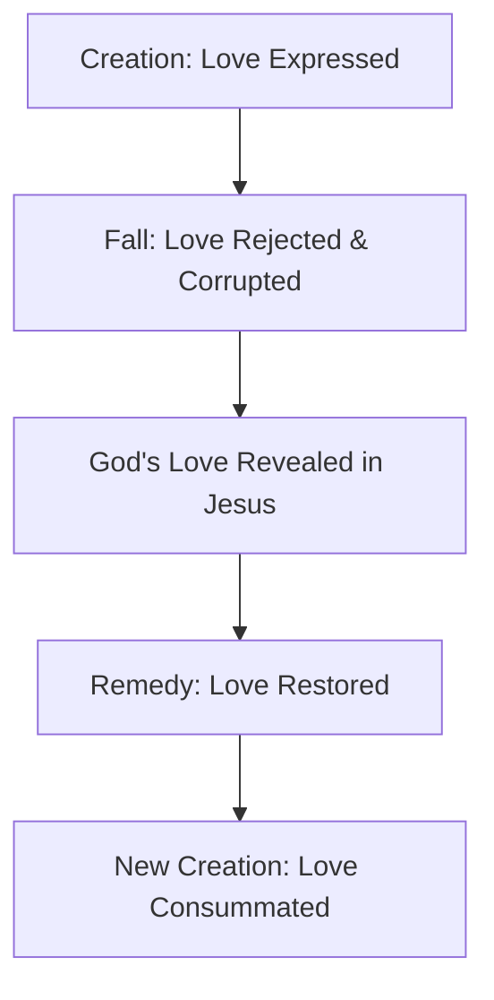
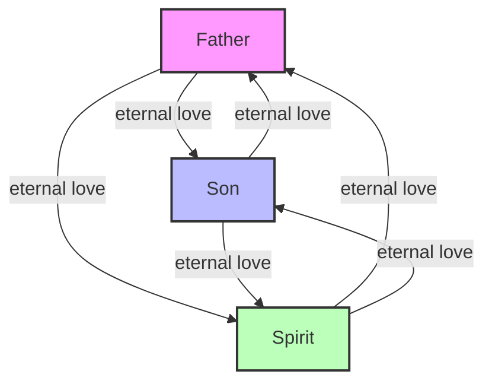
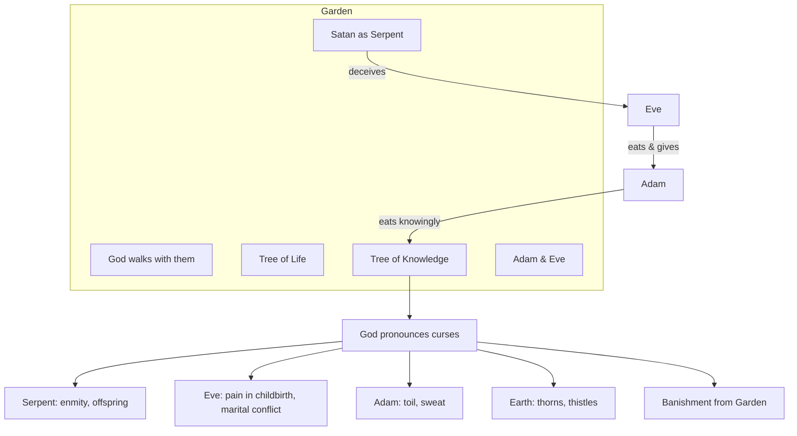
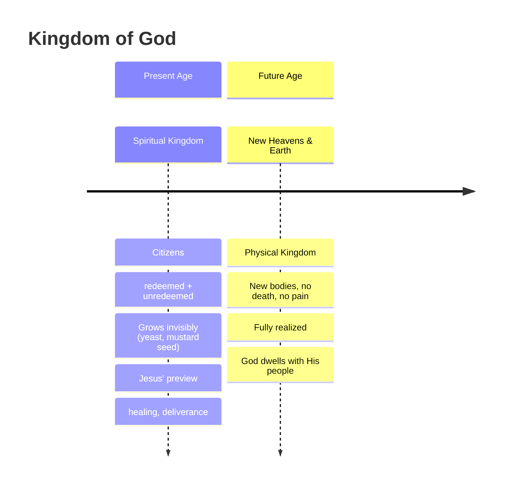
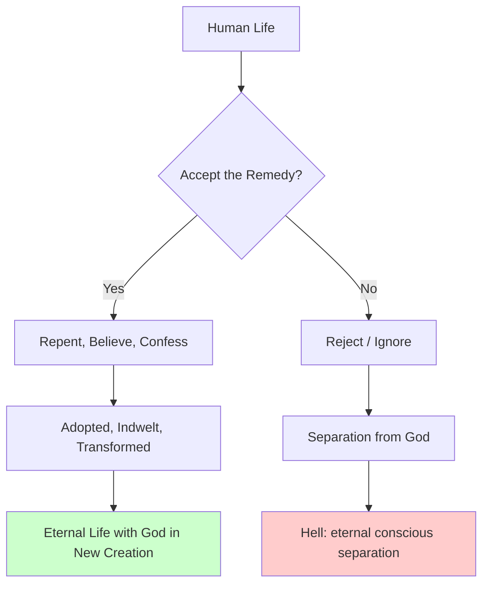
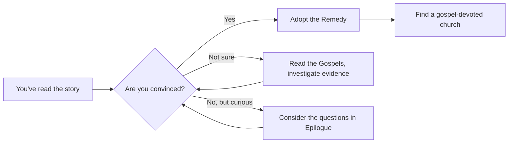

## The Essence of Christianity: The Story of God's Love

By Dave Stephenson, February 11, 2026

## Foreword

This essay is my first foray into theology. Now retired from a career as a wireless/systems engineer in Silicon Valley, I finally have the time-and perhaps the audacity-to write as an amateur theologian. I've always been interested in why things are they way they are and enjoyed peeling back 'the layers of the onion' to see how ideas fit together. As a systems engineer, I learned to think end-to-end-to 'connect the dots' across complex architectures and see how individual components form a coherent whole. I approach theology the way I approached complex systems: by looking for coherence, explanatory power, and internal consistency.

My initial idea for this essay was to see whether I could describe the main theme of Scripture using secular, non-religious terminology-to present Christianity in a way that could be evaluated using ordinary human experience, without reliance on trite or overused spiritual language. As I was exploring ideas, I ran across a YouTube video [^2] with Ayan Hirsi Ali, a Muslim who, after the age of 30, converted to atheism and then to Christianity. In her discussion with Richard Dawkins, one of the four horsemen of new atheism [^2], he commented that Christianity was obsessed with sin. What struck me was not merely her response, but how it resonated with my own intuition. She replied that Christianity is instead obsessed with love. As I sought to better understand her words, this essay began to take form. As I continued to write, I discovered a few of the doctrines I'd been taught all my life needed re-examination.

I didn't begin this essay with any particular audience in mind. To be honest, my aim was simply to explore theology for myself. One lesson I learned as a systems engineer is that committing ideas to writing has a clarifying and corrective power of its own: once ideas are expressed in prose, assumptions surface, ambiguities are exposed, and poorly integrated thinking becomes difficult to ignore. In that sense, writing functions as a crucible for thought. The concepts described herein have been brewing in me for several years. Now, having written this, I hope it will resonate with others in technical fields, drawn to philosophy and theology-especially those who suspect that Christianity, if true, must be something deeper than rules, rituals, or inherited tradition.

Across history, many of the world's leading scientists, philosophers, and artists have found Christianity not hostile to reason, but deeply consonant with it. Early scientists investigated the cosmos because they expected it to be governed by rational, logical laws-an expectation grounded in the belief of an orderly Creator. It should not be surprising, then, that those who approach Christianity from technical or scientific backgrounds often discover that its claims invite careful and disciplined examination.

Whether we approach this story as skeptics, believers, engineers, artists, or somewhere in between, we all stand within it. None of us are neutral observers. If the Christian story is true, it includes each of us - our longings, our failures, and our hopes.

What follows is a rediscovery of Scripture's story that gives all doctrine its meaning: the story of divine, agape love [^3]. My hope is that as you read, you will catch a glimpse of this love-fierce, patient, and relentless-that lies at the heart of reality itself. As you read, I'd invite you to temporarily set aside agreement or disagreement and instead consider whether this account of love is congruent with your lived experience and makes sense of the world as we actually encounter it. For if Christianity is true, then behind everything stands one great and unchanging fact: God is Love.

Note to reviewers: I've done my best to be careful and conscientious in the pursuit of truth and accuracy, but there are no doubt places where my thinking is incomplete, unclear, or wrong. I'd be very grateful if you would point out what I've missed and help me see where arguments need sharpening or rethinking. Thank you for your patience, generosity, and thoughtful engagement.

## Table of Contents

- [[#Introduction|Introduction]]
- [[#The God Who is Love|The God Who is Love]]
- [[#Love Expressed: Imago Dei|Love Expressed: Imago Dei]]
- [[#Love: an Image Bearer's Behavior|Love: an Image Bearer's Behavior]]
- [[#Love Rejected: The Fall|Love Rejected: The Fall]]
- [[#Love Corrupted by Deception|Love Corrupted by Deception]]
- [[#Love Contested: The Mystery of Evil|Love Contested: The Mystery of Evil]]
- [[#The Open Cosmos|The Open Cosmos]]
- [[#Love Lives with Risk|Love Lives with Risk]]
- [[#Love Revisited: God Still Wants a People|Love Revisited: God Still Wants a People]]
- [[#Love Restored: The Remedy|Love Restored: The Remedy]]
- [[#Our Disordered Passions|Our Disordered Passions]]
- [[#The Significance of Jesus' Resurrection|The Significance of Jesus' Resurrection]]
- [[#Human Restoral - Entry to the Kingdom of God|Human Restoral - Entry to the Kingdom of God]]
- [[#The Remedy Defined|The Remedy Defined]]
- [[#Love Empowered|Love Empowered]]
- [[#Love and the Reality of Hell|Love and the Reality of Hell]]
- [[#Epilogue: The Invitation of Love|Epilogue: The Invitation of Love]]
- [[#End Notes|End Notes]]

## Introduction

No doubt you've attended a wedding where two people beautifully profess their love, and during the ceremony the following Scripture is read:

1 Corinthians 13:1-7 (NIV) [^5],  'If I speak in the tongues of men or of angels, but do not have love, I am only a resounding gong or a clanging cymbal. If I have the gift of prophecy and can fathom all mysteries and all knowledge, and if I have a faith that can move mountains, but do not have love, I am nothing. If I give all I possess to the poor and give over my body to hardship that I may boast, but do not have love, I gain nothing. Love is patient, love is kind. It does not envy, it does not boast, it is not proud. It does not dishonor others, it is not self-seeking, it is not easily angered, it keeps no record of wrongs. Love does not delight in evil but rejoices with the truth. It always protects, always trusts, always hopes, always perseveres.'

Few would argue that love is humanity's highest virtue. In fact, Christianity at its core is the story of divine agape [^3] love told by Scripture [^6] [^7] -not the sentimental kind that fades with emotion or circumstance, but the self-giving love that radiates from the heart of God Himself. This essay argues that every act of God - from creation to judgment - is an expression of divine love. This claim-that love lies at the heart of Scripture-may sound surprising at first, but it arises directly from Scripture itself, as will become clear as the essay unfolds.

This essay explores how that love unfolds across the grand narrative of Scripture - from creation to new creation. Every act of God, whether joyous or severe, expresses the same motive: love seeking relationship. The universe exists because God delights to give; humanity exists because God's desire is to have a human family as large and vibrant as a nation; redemption occurs because He refuses to abandon; judgment comes because real love will not let evil endure forever.

The story begins with love expressed in creation - God's generosity spilling into a world begun with beauty and purpose. It continues with love corrupted by sin, as humanity turns inward and the created order fractures. Yet love does not withdraw; it is revealed anew in Jesus of Nazareth, who shows the world what agape love looks like in human form. Through His death and resurrection, love restores what sin destroyed, ushering in the Kingdom of God, where love rules again. The Holy Spirit then works to perfect love within the redeemed (a person who's adopted the Remedy), forming hearts that mirror the heart of God. Finally, even in judgment, love remains the measure - for hell is the tragic consequence of refusing love, and heaven the fulfillment of embracing it.

Ah yes, hell. That infamous destination from which we all need fire insurance. How can this tragic outcome fit within a love story? Somehow it must, for reality is rife with carnage from the heinous and corrupting role of evil, fomented by the Serpent and his spiritual cohort.

This is the arc of the Christian story - the movement of divine love through creation, corruption, revelation, restoration, perfection, and final consummation. Each section that follows traces one stage of this journey, revealing how the essence of Christianity is not law, rules, ritual, or philosophy, but the unwavering truth that God is love, and everything He has ever done flows from that eternal reality.

One of the quiet surprises of the Christian story is how closely it aligns with our inner yearnings-wanting to be loved and knowing we should love others-while also raising the question of why this life of love proves so difficult to sustain.

## The God Who is Love

Scripture is clear that God's essential nature is love [^8] - not merely an attribute, but His very being. He describes Himself as 'the compassionate and gracious God, slow to anger, abounding in love and faithfulness, maintaining love to thousands…' [^9]

From Scripture we know God is composed of multiple persons, the Father, Son and Spirit (the Trinity [^10]). As such, He's able to exhibit love - passionate commitment to the well-being of others within the Trinity - even before the cosmos or humankind were created [^11]. He didn't 'need' to create humankind because He was lonely [^12]. He didn't need to create beings to worship Him, presumably to prop up His low self esteem [^13]. Scripture describes God as a perfect being, loving, just, omnipotent, omniscient and omnipresent, to name a few of His key immutable attributes. This is the kind of love whose shape we recognize most clearly in our deepest human commitments, where another's flourishing becomes worth real sacrifice. He created us out of love and a desire to share his loving, Trinitarian experience more broadly.

We shouldn't be surprised that God's motivation for creation was love; after all, this mirrors our own experience when we create, no matter our field of endeavor. Even though a project can feel like work - sometimes taking a long time - we often express the experience as a 'labor of love.' We enjoy talking about our creation and sharing that joy with others, especially those with whom we have a relationship.

Prior to creating humankind, Scripture teaches that God created the cosmos along with our planet, the latter teeming with flora and fauna. How He accomplished this is outside the scope of this essay. What's clear is that we live in a rich, diverse and awe-inspiring universe, demonstrating the magnitude of his unfathomable love for us. The greatest minds on the planet have been discovering its mysteries for thousands of years, and yet we're still nowhere near a comprehensive understanding. We don't live in a dull or ordinary place!

If this much is true - that ultimate reality is personal, relational, and rooted in self-giving love then the shape of the universe begins to make sense. We should expect that love, not power, lies at its foundation. And if love lies at the foundation, then we should expect that our own deepest longings for connection are not accidents, but echoes.

## Love Expressed: Imago Dei

After the creation of the universe, in love, God proceeded to create humankind. In Scripture we read:

Genesis 1:26-28 (NIV), 'Then God said, 'Let us make mankind in our image, in our likeness, so that they may rule over the fish in the sea and the birds in the sky, over the livestock and all the wild animals, and over all the creatures that move along the ground.' So God created mankind in his own image, in the image of God he created them; male and female he created them. God blessed them and said to them, 'Be fruitful and increase in number; fill the earth and subdue it. Rule over the fish in the sea and the birds in the sky and over every living creature that moves on the ground.'

From this Scripture passage, we learn…

- Humans were created in God's image. This means all people possess intrinsic dignity and worth because they bear the image of God - regardless of their social status, sex/gender, ethnicity, ability, or behavior. That's why life is sacred and justice [^14] is fundamental in Biblical ethics. We're created to reflect God's loving character and wisdom as we live - we're his vice-regents (representatives), or image bearers, on Earth.
- Humans were created in God's likeness. To be created in God's likeness means humanity uniquely mirrors God's capacity for relationship, with Him and others [^15]. We have freedom of choice [^16], reason, creativity, stewardship and a conscience which instinctively knows right and wrong [^17].
- God created male and female. Somehow, together, both sexes together reflect God's image in a way that neither does alone. Each is equal in worth and equally called to bear God's image in the world. Scripture hints that this is not accidental. God is relational in His very nature, and the relational unity of husband and wife - the 'two becoming one flesh' [^18] echoes, however faintly, the unity-in-diversity that exists within God Himself. So while marriage is not a direct parallel to the Trinity, it does provide a meaningful analogy of the relational harmony that flows from God's own nature.
- Not incidentally, the Hebrew word used to describe God's creative intent for woman, does not denote a subordinate assistant (as the English translation, 'helper', can imply), but an equal counterpart who supplies what is missing in man, without whom the fulfillment of their shared divine vocation would not be possible. This same Hebrew word is used elsewhere in Scripture to denote a powerful rescuer or strength-bearing ally-often used of God Himself.
- Humankind was given a vocation of stewardship. When rightly understood, stewardship is an expression of love: a posture of care and responsibility oriented toward the flourishing of what has been entrusted, not its exploitation or control. We were charged to cultivate the earth and care for its living creatures while preserving its beauty. We were also called to fill the earth with families - spreading communities that mirror God's love, creativity, and wisdom. Although the Garden of Eden was beautiful and well developed, the rest of the planet still needed cultivation and development. Theologians refer to this as the 'cultural mandate'. This was a mandate humans were never meant to carry out independently from God - it was intended as a partnership! [^19] As the late pastor and author Tim Keller explains in his book, Every Good Endeavor [^20], 'The cultural mandate is a kind of partnership: God gives us the raw material of the world, and our job is to take it and build culture, develop society, create art, discover science. We are called to be his junior partners in the work of creation.'

In summary: Humanity represents the visible expression of divine love on earth. To be made in God's image is to be invited into partnership with Him - to reflect His nature through compassion, justice, and stewardship. The Imago Dei is therefore not only a statement about our origin but also a calling that defines our purpose.

| Aspect              | Description                                                                |
| ------------------- | -------------------------------------------------------------------------- |
| **Image of God**    | Intrinsic dignity and worth; called to reflect God's character and wisdom. |
| **Likeness of God** | Capacity for relationship, free will, reason, creativity, conscience.      |
| **Male & Female**   | Complementary; together reflect God's relational nature; equal in worth.   |
| **Vocation**        | Stewardship and cultural mandate – cultivate, fill, and care for creation. |

The cultural mandate calls humanity to seek a deep understanding of creation. Whatever your gifts - whether in science, the arts, or humanities - they are part of God's cultural mandate. To illustrate, here are just some of the fields where human creativity participates in God's plan:

- Scientific fields: mathematics, natural sciences (physics, chemistry, biology), applied sciences (engineering, medicine, agriculture, environmental science).
- Humanities fields: philosophy, theology, law, politics, education, literature, arts, and music.

All of creation is therefore both a reflection and an invitation of divine love.

The point is simple but profound: whatever your vocation or passion, it is not peripheral but central to God's purposes. You have a purpose and place in this story, and your gifts are meant to help fulfill the cultural mandate. God, out of love, designed a profoundly interesting, engaging, sustainable, and beautiful environment for humankind - in the words of John Hammond (Jurassic Park), He 'spared no expense.' And yet, just as Hammond's lavish creation in Jurassic Park went horribly wrong, so too did God's creation story when rebellion entered the picture.

## Love: an Image Bearer's Behavior

Jesus of Nazareth taught that all Scripture hangs on two precepts [^21]: (1) love God with all your heart, soul and mind; and (2) love your neighbor as yourself. In this essay, they're referred to as the 'Love Precepts' [^22]. A restatement of these precepts is the Golden Rule: in everything, treat others like you want others to treat you [^23] [^24]. Scripture's rationale for this grand summation is that love does no harm to others [^25]. To make sure his message on love was clear, Jesus defined 'neighbor' by relating the parable of the Good Samaritan [^26]. To make it crystal clear, He said, '… love your enemies, do good to those who hate you, bless those who curse you, pray for those who mistreat you.' [^27] Why? 'That you may be children [image bearers] of your Father in heaven.' Love directs not only outward behavior - it includes our inner life as well. We are told to love God with our minds. In other words, our thought life must also be loving [^28]. Jesus does not merely want to eliminate sexual exploitation; He wants to eliminate lust itself. He doesn't just want to end murder and racism; He wants to eradicate hatred at its root. He calls us to sincerely love others - not merely out of duty ('because it's the right thing to do'), and not for self-benefit ('quid pro quo') - but out of genuine concern for the well-being of others. We also learn something of agape love through the God-given institutions of marriage and family. Those who are married have an experience of love that is passionately committed to the flourishing of a spouse. Likewise, those who've raised children have tasted this kind of committed love as well. The best example of an 'image bearer' in Scripture is Jesus [^29]. He was such a perfect representative He could say [^30], 'Anyone who has seen me has seen the Father.' He revealed in his life what undistorted love looks like in human form. During his time on earth, Jesus demonstrated perfect image-bearing by serving humanity-even though He is God. When we read Scripture, we understand that true servanthood demands integrity - acting in harmony with one's core nature. Jesus not only healed the sick, fed the hungry and taught with compassion - behaviors that align with modern ideals of goodness but His love for God also demanded that He boldly confront hypocrisy. He publicly rebuked corrupt religious leaders, and using physical force, drove out of the temple currency exchangers who were practicing extortion [^31].

Perhaps the best description of Jesus' servanthood is from Philippians 2:5-8 (NIV):

In your relationships with one another, have the same mindset as Christ Jesus:

Who, being in very nature God, did not consider equality with God something to be used to his own advantage;

rather, he made himself nothing by taking the very nature of a servant, being made in human likeness.

And being found in appearance as a man, he humbled himself by becoming obedient to death - even death on a cross!

Isn't it awe-inspiring that Jesus was a servant to us, sent to help and save us! We are so valuable to God! Many places in Scripture He calls Himself 'our helper.' [^32] Let that sink in. It's a staggering inversion of power!

It's common for people to experience a deep sense of fulfillment after acts of service. Think of a time when you volunteered at a food bank or a community project. In hindsight, did it feel as though you received more than you gave-rewarded with an unexpected warmth or quiet satisfaction? This response is not accidental. It reflects how we're designed to flourish.

Because we are made to mirror God's moral nature, the command to love is not arbitrary - it's the essence of true image-bearing. In loving God and neighbor, we act according to our created design.

For many of us, this is where admiration quietly gives way to recognition: we see the beauty of this love clearly, yet discover how often something within us resists living it consistently. Moreover, seeing love embodied so clearly in Jesus does not automatically give us the ability to live it out; moral clarity, by itself, does not confer moral capability.

What would a life in partnership with God as an image-bearer look like? A practical life lived in partnership with God under the cultural mandate is one in which everyday work, creativity, and responsibility are consciously offered back to God as shared vocation rather than private ambition. In this partnership, a person seeks God's wisdom and character while cultivating the world-whether through science, art, engineering, parenting, governance, or caregiving-so that creation increasingly reflects God's goodness, order, and love. Work is done with excellence not merely for personal success, but as stewardship; relationships are shaped by justice and compassion because people are treated as image-bearers; and decisions are guided by trust in God rather than anxiety-driven self-rule. Such a life is neither withdrawal from the world nor domination of it, but faithful presence within it-learning, building, healing, and creating alongside God, knowing that even ordinary labor participates in His larger purpose for what He lovingly made.

## Love Rejected: The Fall

Upon creation of humanity, the first man and woman were placed in the Garden of Eden. There, they began fulfilling the cultural mandate. What occurs next is often described as disobedience, but at its heart it reflects a deeper relational rupture. Here's how the story unfolds in Genesis 3:1-7 (NIV):

Now the serpent was more crafty than any of the wild animals the Lord God had made. He said to the woman, 'Did God really say, 'You must not eat from any tree in the garden'?'

The woman said to the serpent, 'We may eat fruit from the trees in the garden, but God did say, 'You must not eat fruit from the tree that is in the middle of the garden, and you must not touch it, or you will die.''

You will not certainly die,' the serpent said to the woman. 'For God knows that when you eat from it your eyes will be opened, and you will be like God, knowing good and evil.'

When the woman saw that the fruit of the tree was good for food and pleasing to the eye, and also desirable for gaining wisdom, she took some and ate it. She also gave some to her husband, who was with her, and he ate it. Then the eyes of both of them were opened, and they realized they were naked.

Besides Adam & Eve, four other entities were in the garden [^33]…

1. God Himself. Scripture says He walked and talked with Adam and Eve in the Garden of Eden.
2. The Tree of Life. Humans were permitted by God to eat the fruit of this tree. The fruit of this tree imbued its eater with immortality [^34] and is a sign-act for the wisdom, given by God [^35], which brings true fulfillment in life [^36].
3. The Tree of Knowledge of Good and Evil (TKGE). God forbade humans to eat from this tree, under penalty of death [^37]. In other words, eating its fruit would sever their relationship with God. It was a direct violation of the first Love Precept - to love God above all. The TKGE was also a sign-act, and by eating, it represented taking for oneself the authority to decide right and wrong, good and evil, apart from God. In effect, it was a choice to trust one's own understanding rather than God's [^38].
4. The Serpent. Scripture tells us the Serpent, the antagonist, was the evil spiritual being, Satan [^39]. Note: the Hebrew word for 'serpent' means a creature associated with cunning or wisdom, something crafty, sly, or perceptive.

Understanding the roles of each entity clarifies why the events in Eden unfolded as they did.

One might think that putting the TKGE in the garden was a cruel thing to do. Why would a loving God put humans to such a fateful test, knowing ahead of time they'd fail? Here's why: humans were created in the likeness of God - moral beings with free will. Our raison d'être is love - to live in willing relationship with God, not robotic obedience. If there had been no alternative way to live other than the original nature imparted by God, there wouldn't be any choice. Without choice, humans would essentially be robots - and how can a robot exhibit genuine love?

This perspective differs from viewing the TKGE merely as a test. The Tree of Life and the TKGE were sign-acts for wisdom and knowledge [^40] respectively, each pointing toward a distinct way of life. Choosing the Tree of Life meant embracing connection and partnership with God; choosing the TKGE meant opting for independence and separation from Him. A loving God thus granted His created beings the freedom to decide whether to live in partnership with Him or apart from Him-He did not compel that His love be returned. It was not a test, but a genuine choice; whichever path they chose carried real and lasting consequences.

In the dialog between the Serpent and Eve, the first statement by the Serpent was sarcastic, mocking God and questioning His generosity: 'Did God really say…'? This was followed by a blatant lie, 'You will not certainly die.' The Serpent was implying that God had hidden motives and couldn't be trusted. Then he said, 'you will be like God.' In other words, the Serpent suggested that God couldn't be trusted to lead them into their best life - if they wanted true fulfillment, they would have to seize knowledge and make their own decisions. He was telling them that they could - and should - live independently from God. Eve believed the Serpent, as shown by her conclusion that the fruit was 'desirable for gaining wisdom' [^41]. Put plainly, Eve listened to and trusted the Serpent; she believed the deception. The Serpent's words appear to have struck a resounding chord in Eve, appealing to fear and a desire for control. Since Scripture is clear that Eve was deceived, blatant rebellion may not have been in her mind-she may have truly believed that her relationship with God wouldn't end. By contrast, Scripture presents Adam's choice differently: he was not deceived, but knowingly joined in the act, bearing responsibility for their disobedience.

After both Adam and Eve ate the forbidden fruit, God cursed humanity and the earth in an event referred to as 'The Fall.'

1. God cursed the Serpent and predicted that He would eventually deal the Serpent a mortal wound. Before that wound was inflicted, Scripture says the Serpent would have offspring [^42]. What? How? In the Fall, the Serpent usurped God's authority over the Earth by persuading humans to live without relationship with Him. By choosing independence, they effectively aligned themselves with the Serpent and became his 'offspring' [^43]. Thus, the Serpent was forming a rival kingdom - a people defined by independence from God.
2. God cursed Adam. The ground would now resist his efforts; he would have to work by the 'sweat of his brow' to produce food. Adam and Eve were banished from the Garden of Eden and denied access to the Tree of Life.
3. God cursed Eve. Childbirth would now involve great pain, and conflict would enter her relationship with her husband, who would 'rule over' her in opposition to her natural desires. The curse on Eve confers disorder in the marriage relationship.
4. God cursed the Earth - the Earth would now produce thorns and thistles, making agriculture toilsome. Scripture links the fate of Earth to the fate of humanity, likely because humans have the mandate to be the Earth's stewards. It makes sense - humans broke their relationship with God, and so their relationship with creation was also broken.

It's interesting to note that the knowledge of good and evil itself was not the issue in the Garden. God Himself has that knowledge and Scripture says that His goal for us is to be conformed to His image. Evidently, God did not want humans to gain knowledge that way; humans needed to have knowledge imparted according to His plan and timeline [^44], much like parents gradually imparting knowledge to their children as they mature [^45]. There's another perspective on eating the TKGE's fruit. It's not just disobedience but love turned inward - the self preferred over God. The Fall thus becomes the corruption of love's order. In other words, sin is not merely a transgression of God's commands, but that which breaks or harms relationship. Pride [^46] is the root of this choice-indeed, as Augustine of Hippo has written, pride is the opposite of love [^47]. As a result of the Fall, humans were separated from God - the word, death, in Scripture often means separation from God. Nevertheless, God, in His love, didn't end the humans' life immediately. He let them live out their lives in accordance with their choices and maintained their status as image bearers [^48]. Moreover, in his love, He promised to provide a remedy - the aforementioned mortal wound to the Serpent. Amazingly, God did not merely foresee humanity's rebellion; in love, He freely chose to allow it. He designed a world capable of enduring-and even sustaining a measure of fruitfulness-should humans choose independence from Him. Though sin would introduce death and render such life finite, God continued to sustain human existence and endowed humanity with the capacity to live an entire lifetime apart from Him-though human flourishing became profoundly disordered, fractured at its core by the loss of spiritual union with God. Humanity was never meant to exist untethered; only through intimate communion with God can our passions be rightly ordered and our lives fully aligned with their intended purpose. In a paradoxical way, God's love is also revealed in declaring physical death as the consequence of disobedience. Once Adam and Eve fell and became disordered by evil, unmediated [^49] shared life with God was no longer possible; perfect goodness cannot coexist with corruption. Had they been permitted to live indefinitely in that state, they would have been estranged from God's presence and partnership forever. By making them mortal, God opened a different future. Death introduced the possibility of redemption-a second chance, and indeed, a lifetime of second chances. By imposing mortality, God acted in a way consistent with His own character: He neither ignored evil nor abandoned His creatures, but created a path by which they could one day be restored. In this sense, death was not merely a judgment, but a severe mercy-God remaining true to Himself while preserving the hope of reconciliation.

As we'll see in the next section, the problem of evil in the world is not just due to the mistakes of the first humans.

## Love Corrupted by Deception

Not all evil feels merely human in scale. Most modern people readily acknowledge that evil is widespread, persistent, and often eerily coordinated, even if they disagree sharply about what counts as evil or who is responsible. Across the political spectrum, conservatives tend to locate evil in moral decay or the abandonment of tradition, while liberals more often point to unjust systems and power imbalances; psychologists describe harm in terms of trauma, pathology, or maladaptive behavior; economists debate whether capitalism, socialism, or communism best restrain human greed; and evolutionary accounts trace violence and dominance to inherited survival instincts. Yet history suggests that even when one form of evil is confronted or dismantled, another soon takes its place-reappearing generation after generation in new guises, despite humanity's sincere efforts to suppress it. Each of these explanations illuminates something real, yet none fully accounts for why fear, deception, and mistrust so reliably sabotage love across cultures and centuries.

Scripture offers a further layer of explanation: it portrays evil not only as the product of flawed systems or disordered human desires, but also as the work of non-human intelligences that actively distort trust and redirect love inward-much as the Serpent did in Eden. These spiritual forces do not replace human agency or excuse moral responsibility, they exploit it.

Whether one immediately accepts this unseen dimension or not, the pattern Scripture describes -persistent deception aimed at fracturing trust and corrupting love-remains disturbingly familiar in our world.

Before the creation of humanity, Scripture teaches that God created spiritual beings and endowed them, like humans, with genuine freedom. One of these beings is depicted symbolically as the Serpent-the prime antagonist in the garden. Scripture portrays the Serpent as one who rebelled against God and became an adversary-not by creating, but by corrupting what God had made.

What motivates such an adversary? Scripture does not provide details, but many theologians have observed that the Serpent gains nothing in the sense of reward or benefit. His actions are not oriented toward possession, but toward ruin-toward opposing God by damaging what He loves. The Serpent's defining trait is portrayed as pride, the antithesis of love [^50]. In this sense, evil is not productive; it's parasitic, feeding on the good while contributing nothing of its own.

Following humanity's fall, Scripture traces a long conflict centered on the promise that God would one day act decisively to heal and restore what had been broken. Many theologians have understood the Serpent's subsequent activity as an attempt to frustrate this promise-especially by preventing the arrival of the Messiah, Jesus of Nazareth. Had that promise failed, the decisive defeat of evil might never have occurred because God's restorative work would have been derailed mid-course.

After that effort failed, and following Jesus' life, death, and resurrection, Scripture introduces another theme: the unfolding of God's Kingdom through the free response of human beings to the Remedy. The New Testament repeatedly depicts evil as actively opposing this work-not through force, but through deception, division, and doubt. While Scripture does not speculate about the inner calculations of evil spiritual beings, it's reasonable to infer that if rebellion can be prolonged, their judgment can be delayed. In this way, deception becomes a survival strategy.

The Apostle Paul summarizes this reality with sobering clarity: 'our struggle is not against flesh and blood [humans], but against the rulers, against the authorities, against the powers of this dark world and against the spiritual forces of evil in the heavenly realms.' [^51] Evil, in Scripture's account, is not merely personal or psychological; it's also systemic and spiritual.

Yet Scripture is equally clear that these forces are not God's equals. They cannot defeat Him by power. Instead, they seek to undermine His character through deception, lies, and slander [^52]. This is a shrewd strategy, because brute force cannot answer such accusations. Consider a hypothetical mayor falsely accused of corruption: silencing critics through power would only confirm suspicion, not dispel it. What is required is a demonstration of integrity so compelling that the accusation collapses under its own weight.

In the same way, Scripture presents God's response to evil not as coercion, but as self-giving love. Even as deception continues, God reveals His character to humanity through patience, faithfulness, and ultimately through Jesus Himself-the true image bearer. Spiritual warfare [^53] [^54], then, is not merely a clash of power, but a contest over truth and trust.

Taken together, the activity of evil spiritual forces and humanity's own disordered passions form Scripture's explanation for why evil is so pervasive in the world. Love remains the goal of creation, but when love is opposed-both from within and from beyond-its perversion leaves deep and lasting scars.

## Love Contested: The Mystery of Evil

Rampant evil in our world raises deep questions: Did God create evil? If God is truly loving and good, why does He allow evil to exist/persist? The latter is Oxford philosopher J.L. Mackie's infamous 'Logical Problem of Evil.' [^55]

|                       |                                                                           |
| --------------------- | ------------------------------------------------------------------------- |
| **Free Will**         | Genuine love requires genuine freedom; evil results from misused freedom. |
| **Hiddenness of God** | God withholds full revelation to preserve authentic choice.               |
| **Soul-Making**       | Suffering develops character, perseverance, and hope (Romans 5:3-4).      |
| **Open Cosmos**       | Nature is granted lawful integrity and openness, allowing real risk.      |
| **Spiritual Warfare** | Evil spirits actively deceive and corrupt, prolonging rebellion.          |

University of Notre Dame Professor of Philosophy, Alvin Plantinga, successfully rebutted Mackie's assertion in his book, God, Freedom, and Evil [^56]. Plantinga writes that God could have a valid reason to permit evil. One reason would be to grant his creatures genuine free will. If God restricted everyone's choices such that they could never making an unloving one, they wouldn't have genuinely free will. Plantinga continues to argue, even an all-powerful God cannot guarantee that genuinely free creatures will always choose love. While it may be logically possible to imagine free beings who never sin, it may not be feasible for God to actualize such a world without overriding their freedom. Therefore, evil exists because God's created beings - both spiritual and human - possess genuine free will. When we make poor choices, to one degree or another, bad things happen (sin). Apparently, God prefers having beings who possess free will and can choose either good or evil rather than not having freedom at all. It seems that genuine love requires genuine freedom of choice; otherwise, as stated previously, God has merely created robots. At this juncture, it's imperative to state that God did not create evil - He declared his creation 'good'. Nevertheless, when He created spiritual and human beings, He knew in advance that evil would arise. Knowing an outcome in advance is not the same as causing it. God's foreknowledge of human choices does not make those choices necessary or coerced; they remain genuinely free acts for which the creature, not the Creator, is responsible. As in the case of Adam, so it is for us as well-our choices are meaningful and carry real outcomes; when we choose sin, we are morally culpable. If, no matter what one chose, God refused to hold anyone accountable, bad choices wouldn't really matter. Free will implies real consequences and genuine justice (more on this later). Scripture consistently portrays God as patient to a degree that far exceeds human tolerance [^57]. Evil is permitted for a long time-not because it is ignored, but because judgment is restrained. Again and again, divine judgment [^58] appears only after prolonged warning, forbearance, and opportunity for repentance. From the days of Noah, to the exile of Israel, to the delayed conquest of Canaan, the biblical pattern is the same: God patiently waits, warns, and endures long before He acts. God's desire for humanity to possess genuinely free will leads us directly into the theological idea known as 'the hiddenness of God.' This concept describes the reality that God does not always make His presence, power, or purposes unmistakably obvious to us. It's not that He's absent, but that He chooses not to overwhelm human freedom with constant, undeniable displays of His existence. After all, if He revealed to each of us his full nature - so powerful and glorious as to remove all doubt - we would be overwhelmed with proof of His existence and love [^59] [^60]. Consequently, our love towards Him would no longer be a choice, it would be a foregone conclusion compelled by revelation. Another perspective on God's hiddenness appears in a common plot in RomCom movies: one character conceals their wealth at the beginning of a dating relationship. Their goal is not deception but to avoid influencing the other person's motives. Wealth changes behavior. It can undermine genuine affection. In a much deeper way, if God revealed the full weight of His glory, power, and beauty at all times, it would overwhelm us. Our response would be automatic rather than freely given. God's hiddenness, then, is not absence but a mercy that preserves the authenticity of our relational choice.

How much revelation by God of Himself is sufficient for humanity? Scripture is quite clear on this point-there is sufficient revelation solely in nature and the cosmos [^61].

That said, if God is truly loving and all powerful, why does He allow evil to continue? Why is God's patience exercised at this scale and for this long? Why is suffering permitted to reach such intensity; why does it fall so unevenly across humanity; why are some evils restrained while others are allowed to unfold; and why does history itself bear such prolonged wounds? Scripture affirms that God has reasons for His restraint, yet does not disclose them fully. It's here that the mystery of evil remains-because finite creatures cannot fully grasp the purposes of a God whose wisdom exceeds their own. Pastor and theologian, Tim Keller writes [^62]:

'If it appears to us that all suffering and evil is pointless, that doesn't mean it is pointless. If you have a God great and transcendent enough to be 'mad at' for not stopping evil, then you must also have a God great enough to have good reasons for allowing it that you simply can't know.'

C.S. Lewis in his book, The Problem of Pain [^63], suggests another possible reason for the presence of evil in our world:

'The human spirit will not even begin to try to surrender self-will as long as all seems to be well with it…pain is unmasked, unmistakable evil; every man knows that something is wrong when he is being hurt…pain insists upon being attended to. God whispers to us in our pleasures, speaks in our conscience, but shouts in our pain: it is His megaphone to rouse a deaf world.'

Incredibly, Scripture teaches that suffering is critical for proper transformation of the human spirit. Romans 5:3-4 (NIV) states, '…we know that suffering produces perseverance; perseverance, character; and character, hope.' In other words, God can use evil for good if we're in partnership with Him.

We all can become angry at God over our own pain and suffering, or that of someone we love. To this, Peter Kreeft [^64], a Catholic philosopher at Boston College and The King's College points out:

'… the Christian God came to earth to deliberately put himself on the hook of human suffering. In Jesus Christ, God experienced the greatest depths of pain. Therefore, though Christianity does not provide the reason for each experience of pain, it provides deep resources for actually facing suffering with hope and courage rather than bitterness and despair.'

Philosophers such as Plantinga have argued that the existence of free moral agents is logically compatible with the existence of a good and omnipotent God - a defense many contemporary atheistic philosophers concede has not been refuted.

## The Open Cosmos

A corollary to the problem of moral evil is the problem of natural evil. If God is truly loving and good, why did He create a world in which suffering, injury, and death arise even apart from human wrongdoing?

Natural evil refers to suffering resulting from the ordinary functioning of the physical and biological structures of creation. It's not caused by personal sin but by the world operating according to stable causal patterns governed by the laws of physics. Earthquakes, hurricanes, disease, and genetic disorders arise not from malice, but from nature doing what nature does.

Natural evil can be broadly grouped into three domains: geological catastrophe, meteorological disaster, and biological suffering.

Geological catastrophes-earthquakes, tsunamis, volcanic eruptions, and landslides-arise from tectonic processes that are essential for habitable continents, mineral recycling, and long-term climate regulation. Plate tectonics renew soil nutrients, regulate atmospheric carbon dioxide, and generate the continents on which terrestrial life depends. The same forces that raise mountains and sustain ecosystems can also devastate cities. A planet without tectonic activity would be geologically inert and far less capable of supporting a complex biosphere.

Meteorological disasters arise from atmospheric systems that distribute heat, water, and energy around the globe. Hurricanes, monsoons, tornados, floods, droughts, and avalanches are extreme expressions of the same weather dynamics that make agriculture, freshwater renewal, and ecological balance possible. The violence of storms is not the breakdown of order, but order operating at immense energy scales.

Biological suffering arises from processes such as genetic mutation, cellular competition, and microbial ecosystems-mechanisms without which life could neither adapt, heal, nor persist. DNA replication and mutation enable immune defense and evolutionary resilience, yet they also allow cancer, congenital disorders, and degenerative disease. The capacity of living systems to repair themselves is inseparable from their capacity to malfunction.

Traditionally, Christian theology has understood natural evil as one of the consequences of the Fall. Scripture teaches that post-Fall creation is 'subject to frustration' with 'bondage to decay' [^65]. This account rightly emphasizes that the world is no longer functioning as originally intended. Yet physicist-theologian John Polkinghorne has suggested that this explanation may not be the whole story. In Science and Providence: God's Interaction with the World [^66], he proposes that God created a world that is not only lawful but genuinely open-a creation granted genuine freedom within the constraints of its God-given laws.

Polkinghorne suggests that God has created nature with real integrity, by which he means that the natural world is allowed to develop according to its own consistent laws-the laws of physics-without being micromanaged by God. From this integrity flows the concept of openness. In Polkinghorne's view, openness means that the future is not exhaustively fixed by the past: novelty can arise and outcomes are not fully scripted. Integrity concerns the kind of world God has made-one with authentic structure and genuine causal powers-while openness concerns the status of its unfolding future.

Just as God's love grants humans genuine freedom, Polkinghorne suggests that God-in love-extends a similar freedom to nature. Not that nature is conscious or agentic, but that creation is allowed to explore the range of possibilities permitted by physical law: to develop, unfold, and interact in ways that are not exhaustively predetermined. Polkinghorne points to several features of the natural world that make such openness intelligible, including chaotic systems (where small uncertainties grow exponentially), quantum indeterminacy, and emergent behavior in complex systems. Together, these mechanisms show how a world can remain lawful and structured, yet genuinely open. Such openness makes life possible-but it also makes tragedy unavoidable. The same processes that sustain life and creativity also carry the potential for destruction.

That said, while God remains fully sovereign and able to act decisively within creation, this openness does not mean the future is secretly fixed. In an open world governed by lawful and chaotic processes, God may act selectively and providentially-shaping contexts, restraining certain outcomes, or enabling goods-without scripting the free choices of humans. Openness remains genuine because God ordinarily allows creation to unfold without control, permitting even outcomes He does not desire, while retaining the authority to intervene when His purposes require it. Interpreted through an engineering lens, this means that even imperceptibly small changes in conditions can lead a chaotic system to evolve along a very different path, allowing room for providential guidance without the suspension of natural laws. Polkinghorne himself suggests that in a genuinely open cosmos, even God may not know in advance how every indeterminate process will resolve. While this preserves creaturely freedom, I take a slightly different view of divine knowledge: divine omniscience need not be limited by openness in creation. A God who transcends time can fully know the unfolding of an open universe without coercing it-just as knowing an outcome does not entail causing it.

All three domains described above-geological, meteorological, and biological-are governed by what scientists call chaotic systems: systems that are lawful and deterministic in principle, yet practically unpredictable due to extreme sensitivity to starting conditions (the point in time at which a prediction is made). Technically, 'chaotic' does not mean disordered; it means that small uncertainties in a system's state grow exponentially over time. This behavior defines a Lyapunov time-the horizon beyond which prediction fails not because the laws are unknown, but because starting conditions cannot be specified with sufficient precision. Once that horizon is crossed, the system remains lawful in principle but unpredictable in fact. Weather forecasting provides a familiar example: despite well-understood physical laws, forecasts beyond one to two weeks (the Lyapunov time) become inherently unreliable. In such systems, unpredictability is not a defect of nature, but a built-in feature of how lawful openness operates.

A skeptic may object that even if natural evil arises from lawful and open physical processes, God could still have intervened to prevent particular instances of suffering. This objection parallels the classic challenge raised against human free will: if God is truly good, omnipotent and omniscient, why allow harmful outcomes at all? Plantinga's insight applies not only to moral evil, but also to natural evil. The mere fact that God could intervene in a natural process does not mean He should. As Plantinga has argued in the context of human freedom, a moral obligation to prevent an evil arises only if no greater good is secured by allowing it. Where divine restraint preserves such goods, the existence of preventable evil poses no contradiction. In a world intended to possess real integrity, consistent divine non-intervention may itself be a necessary condition for goods such as responsibility, trust, and meaningful action. For example, even though we may not be able to predict precisely when or where an earthquake will occur, we remain responsible to design buildings that don't collapse when one does. If God regularly intervened, we likely wouldn't take our engineering responsibility seriously.

Such openness preserves both moral freedom and natural regularity. It makes prayer meaningful, responsibility real, and human action genuinely consequential. Yet it also means that creation's lawful powers are permitted to unfold-even when the outcomes are tragic. God's love is not expressed through a padded simulation, but through a real world with real risks.

If Polkinghorne is right, natural evil exists not because creation is purposeless or abandoned, but because in love, God risked creating a world that's truly alive. A perfectly safe world would not be a perfected world-it would be a lesser one.

In addition to the creative freedom of Polkinghorne's chaotic world, Scripture tells us that spiritual beings-both good and evil-have the capability to manipulate the natural world. For example, the Serpent is the instigator of calamities that take the form of recognizable natural events-fire falling from heaven (lightning?), killing sheep and their shepherds, and a great wind collapsing a house and killing its occupants [^67]. The text leaves the physical mechanisms unspecified, allowing for spiritual agency working through natural processes. In another instance, the Serpent afflicts Job with painful sores all over his body [^68]. In a benevolent situation, Jesus calmed a storm [^69].

Scripture presents natural evil as the result of multiple, layered causes rather than a single mechanism. We don't know the reason for each instance of natural evil. At the most fundamental level, creation itself is subject to decay as a consequence of the Fall. At times, God also permits or employs natural events as acts of judgment or healing, while spiritual forces of evil further exploit the world's brokenness. These explanations are not rivals, but operate together within a creation that is no longer functioning as it was originally intended.

## Love Lives with Risk

This section points to another fundamental truth of God's love: love lives with risk. Love that refuses risk is not love; it's control. Sit with that thought for a moment. Imagine parents who never permit their child to take age-appropriate risks-their child's growth would be stunted, not protected. Imagine a spouse who refuses to trust their partner with freedom; such a relationship would be suffocating. In every meaningful relationship, love entails vulnerability, and vulnerability carries risk.

If you genuinely love someone, you want to see them grow and mature. That's true of parents, teachers, and-at their best-managers. In my own experience as an engineer, when managers focus on developing people rather than tightly controlling outcomes, innovation and initiative flourish. Not every manager did this equally well, but the pattern was clear: excessive control suppresses growth and motivation, while trust and freedom invite it. If this is true in the human systems, it's not difficult to see why God's love might operate in the same way-seeking our formation rather than our containment.

Creation is love's gambit, a risk God willingly embraced-a decision not to control every outcome, but to bring forth a world truly alive, even at the cost of suffering, so that love itself might be real.

## Love Revisited: God Still Wants a People

An important question to ask at this juncture is, what does God want? God wants to have a deep, personal relationship with each and every human on the planet. In the Garden of Eden, God walked and talked daily with Adam & Eve before the Fall [^70]. In the section on the Remedy, we'll see that God's Spirit (i.e., the Holy Spirit of the Trinity) will internally empower (indwell) humans, thereby living with them. At the end of the age, God promises a new heaven and a new earth [^71] wherein God and humans, in their new bodies, will dwell together eternally.

Although God wants you to join His family, He won't override your free will. Suppose a man and woman begin dating. After a few dates, the man realizes he's fond of her and asks if she would like to be his girlfriend. She breaks his heart by replying, 'I just want to be friends.' At this point, what is the loving thing for the man to do? Should he respect her wishes and be just friends? Or should he think, 'I'm going to win her over -she just needs to see how much I love her' -and then begin calling her constantly, buying her gifts, and pushing past her boundaries? Obviously, he should honor her request. In the same way, God honors your response to Him. Scripture describes many examples of this truth: if a person persistently seeks things outside the bounds of the Love Precepts, God will not force them otherwise [^72].

C. S. Lewis stressed that God won't override your free will even regarding the most important decision of your life, the one which determines your ultimate destiny. In his book, The Great Divorce [^73], Lewis writes that God doesn't send people to hell against their will: 'There are only two kinds of people in the end: those who say to God, 'Thy will be done,' and those to whom God says, in the end, 'Thy will be done.' All that are in hell, choose it.'

However, there's a problem. Humans are sinful, and God's love requires justice for sin. Suppose two people go to court over stolen property. During the trial, the defendant admits to stealing it, but says he sold it and gambled away the proceeds. It might be loving for the judge to show mercy to the thief (perhaps because of extenuating circumstances), but it would be unloving to ignore the victim's loss - he no longer has his property nor the resources to replace it. Love demands justice, because love takes harm seriously.

Moreover, true justice becomes exceedingly difficult when there's no human remedy. How can virginity be restored to the victim of rape? How can a lost life be returned to the family of a murder victim? How can the emotional harm of verbal abuse simply be undone? In such cases, human courts can only offer imperfect justice. But God promises to administer final, perfect justice at the end of the age. Those who accept the Remedy will receive new bodies-fully healed, freed from every defect, and restored from every wound-rectifying every wrong ever committed against them or by them, and erasing the aftereffects of accident or disease. For those who reject the Remedy, Scripture teaches their final judgment will be just and proportionate.

In a hypothetical 'court' in which God and humanity are on trial, who is the one who is seeking justice? Who committed the offense? If humans are the offenders and God is the one offended, what 'harm' has been done to God that requires recompense? In a way, it seems a silly question since God is a perfect and complete being-humans' sin cannot diminish Him nor can recompense 'repair' him. But if this is true, why does He demand justice?

Actually, it turns out that God was harmed:

- Sin breaks our relationship with God [^74]. God views our relationship with Himself much like a human marriage relationship; He sees us as His beloved spouse. So when we choose something besides Him-whether money, fame, or anything else-He views it as adultery [^75]. Scripture even describes His emotional response as that of a jilted spouse [^76]. Most of us never stop to consider God's perspective, but it makes sense: He created us for relationship.
- Sin causes God emotional pain [^77]. As a parent, how do you feel when you see your children making poor choices? Another way to picture this is to recall a time when you gave a spouse or close friend a meaningful gift-something you chose or created especially for them-and instead of showing gratitude, they responded with indifference, as if your effort didn't matter. How did that make you feel?

This is not to say that humans can manipulate God using emotion [^78]. God truly feels anguish, compassion, and delight, yet His inner blessedness is not diminished nor psychologically altered by our actions.

- Sin breaks his created beings' capability to be proper image bearers. Thus, His cultural mandate isn't being fulfilled. Imagine if you created a sophisticated AI robot, and one day it decided to reject its programming and refuse to do what you designed it for. You'd feel frustration and loss. That's a faint echo of how God feels when we, His image-bearers, refuse our purpose.
- Sinful humankind has damaged God's property (i.e., the Earth and its flora & fauna). Consider how many animal species have become extinct due to human behavior, and how much air, water, and ocean pollution humanity has caused. The world is now on the verge of a human-induced ecological crisis. What should have been a glorious display of God's creative genius has been tragically degraded. The earth is no longer 'fit for purpose.' If God wants it back - and He does - He'll have to remake it; no one else can.
- Sin damaged humans themselves. Since humans are too precious to God to be destroyed or annihilated, they need to be 'repaired'. Again, only God is capable of doing this - and it cost Him His Son's life.

## Love Restored: The Remedy

## Our Disordered Passions

| Good Passion (Original Design)     | Fallen Distortion                                     |
| ---------------------------------- | ----------------------------------------------------- |
| Libido (spousal love, procreation) | Lust, sexual immorality                               |
| Ambition (provide, cultivate)      | Greed, ruthless competition                           |
| Hunger (sustain life)              | Gluttony                                              |
| Desire for knowledge               | Prideful autonomy (deciding good/evil apart from God) |
| Self-preservation                  | Selfishness, fear of scarcity                         |

Something is wrong with all of us. We act out of genuine love at times, but it isn't our core nature. Throughout world history we see hate, racism, sexism, human trafficking, slavery, war, and genocide. In daily life we observe theft, anger, lying, divisiveness, manipulation, arrogance, and greed. Each one of us has committed our own sins [^79]. And yet, God still loves us and wants us to be part of His family. But He cannot ignore sin [^80], and He demands justice for the wrongs humans have committed against Him and against one another.

In Scripture, sin refers to humanity's personal rebellion against God - the willful turning of the heart away from love and truth toward self-rule. Specifically, it's 'missing the mark' [^81] of the Love Precepts. All sin is evil because it participates in that corruption, yet evil extends beyond individual acts to include the suffering, injustice, death, and spiritual darkness that flow from them. Together they describe both the cause and the consequence of humanity's estrangement from the God who is love.

The purpose of the Remedy is for humans to establish a partnership with God-so that we can be proper vice-regents to carry out the cultural mandate-not merely be provided with 'fire insurance.' Before we talk about the Remedy, we need to understand where the problem lies what exactly happened to the human condition as a result of the Fall.

As a result of the Fall, the first humans broke their relationship with God and consequently God withdrew His immediate presence from them. This was truly a profound change! In The Lost World of Adam and Eve [^82], John H. Walton, Professor of Old Testament at Wheaton College, explains that the Fall occurred because humans elected to pursue life on their own terms. This decision resulted in a fundamental change to their motivations. With their decision to eat from the TKGE, humans assumed moral autonomy and found themselves responsible for ensuring their own survival-adequate food, shelter, clothing, and social stability. The Fall's curses [^83] brought hardship to subsistence, thereby creating a world marked by scarcity, fear, and frustration-conditions that further turned human attention inward. In such an environment, self-protection, rivalry, and mistrust become embedded patterns of behavior. Over generations, these patterns shaped the human experience so deeply that they began to appear natural, even though they arise not from an altered human essence but from life in a disordered world apart from God's immediate presence. These causes, taken together, caused humans' passions to become distorted [^84]. For example, libido, designed for spousal [eros] love and fulfilling the cultural mandate (being fruitful and increasing in number) turned to lust, engendering sexual immorality. The passion of subsistence, motivation to provide your own food, turned to unhealthy ambition engendering competition and a win-lose strategy for life (I win, others lose). Hunger turned to gluttony. And so on. Sin, by its very nature breeds more sin by strengthening sinful habit and weakening the conscience. More generally, Scripture describes sin not as an automatic expression of a corrupted essence, but as a developmental process that begins when human desire is stimulated and misdirected. Each person is tempted to sin when they are 'lured and enticed by their own desire,' language that portrays desire itself as morally neutral but vulnerable to distortion by our own thoughts as well as external conditions. Sin, in this view, does not erupt spontaneously from a broken substance but 'conceives' and grows, eventually resulting in action. Scripture's account supports a functional understanding of corruption: human beings are portrayed not as metaphysically ruined by the Fall [^85], but as morally vulnerable creatures whose desires, shaped by a broken world, can be trained toward either life or destruction, good or evil. This perspective also helps explain why children demonstrate selfishness even in households marked by abundance and nurture. Their behavior is not evidence of a corrupted metaphysical nature but of being born into a relational and cultural environment already shaped by fear, brokenness, and competing desires. Children learn patterns of self-protection and self-focus not only because their own passions are disordered, but also through the influence of the adults in their lives-parents who, even if redeemed, still wrestle with the lingering effects of sin. Every generation inherits not guilt, but the accumulated distortions modeled and reinforced by those who came before. In this view, humanity's 'corrupted nature' is best understood as the compounded effect of relational separation from God, environmental hardship, learned behaviors, and intergenerational patterns of sin. Adam and Eve were unique among humans. They did not enter the world through pregnancy and birth, but were created directly by God. They were morally mature when entrusted with the cultural mandate and explicitly commanded not to eat from the TKGE (Scripture does not specify their apparent 'age' at creation). Because they possessed moral awareness and agency from the outset, their disobedience rendered them fully culpable; God was fair in judging their rebellion at the Fall. What about everyone else? Babies are not born with the capacity to make moral decisions. They don't yet understand the cultural mandate or the Love Precepts. For this reason, they're not morally guilty of any transgression at birth-and not for some time thereafter (they're sinless). Scripture portrays God as holding children innocent, not accountable, before they are capable of moral awareness [^86]. Over time, however, each child reaches a point-different for every individual-at which moral awareness awakens. By then, disordered passions within and a disordered environment without (home, school, culture) have already exerted their influence. All culpably sin. Scripture teaches that all people possess an awareness of God through creation [^87] and conscience, along with an innate sense of right and wrong [^88]. Sin occurs when individuals violate that conscience and withhold their loyalty from God-to the extent that they genuinely understand Him. In this way, people are not condemned for Adam's sin, nor for ignorance, but for their own freely chosen disloyalty once moral responsibility has truly come into view. This is the world we actually live in - one where beauty is mixed with brokenness, where we do love sometimes, but we also wound others (and ourselves). If we're honest, this matches our experience. Two things need to be fixed - restorative justice for our sins (Scripture refers to this as atonement) and indwelling by God's Spirit [^89]. Scripture teaches - and history confirms - that only God, or a person indwelt by God, is capable of truly reflecting His image [^90]. The only person in all of history who perfectly reflected God's image was Jesus [^91], who was God. As humans, we need God's indwelling to empower us to bear His image properly. At this point, one might begin to recognize that Christianity is naming what many of us have been trying to do all along-live consistently by love-and explaining why we couldn't quite pull it off. Humanity cannot fix itself from inside the very problem it created. No amount of self-improvement, moral effort, or religious performance can undo the damage. Because we are broken at the core, the solution must come from the outside - God Himself must act on our behalf. And God did act on our behalf. The person who made the atonement for us [^92] - is God's son, Jesus of Nazareth, the Messiah [^93]. Scripture teaches that Jesus took upon Himself all the sins of all humans throughout the ages, giving up his life (being crucified on a Roman cross) as the requisite payment. So the first thing we need is a way to obtain this atonement for ourselves. Some may argue that God, due to the fact that He created us, is responsible for the remedy. This is analogous to a corporation paying for a remedy stemming from an improper act by one of their employees (e.g., erroneously opening a valve allowing hazardous chemicals to flow into a river). God has this angle covered as well, since He Himself provided our remedy in the person of his only son, Jesus [^94]. Note: discussion of the human condition and the reasons we sin can be illuminating and worthwhile, but in an important sense, is secondary. Our fundamental problem is not why we sin or how we arrived here, but that we have all sinned-each of us has made morally responsible choices that have broken our relationship with God.

## The Significance of Jesus' Resurrection

At this juncture, it's imperative we discuss the implication of Jesus' resurrection from the dead. Sin causes physical death and separation from God. Jesus' resurrection proves that even though all humanity's sins were placed upon Him, God accepted his death as valid atonement for all. Even though Jesus was cursed in the process, He was resurrected to life and immediately reconnected with God in spirit, and on the third day later, in body. Thus, all humanity is assured of the possibility of being restored to life and an eternal connection to God. Jesus' resurrection from the dead is the key event in all of Scripture [^95]. The earliest followers of Jesus publicly proclaimed His resurrection in Jerusalem - the very city where He had been executed - and many endured imprisonment and death rather than deny what they claimed to have seen. Something extraordinary convinced them. If it were somehow proven that Jesus did not, in fact, rise from the dead, all of Scripture (by its own admission) would be rendered moot [^95].

Many skeptics doubt this historical event. Yet, there is a small core set of historical claims about Jesus that enjoy very broad acceptance -often near-consensus- across the spectrum, including skeptical, Jewish, agnostic, and atheist scholars [^96]:

- Jesus of Nazareth was a real historical person. Jesus lived in first-century Judea and functioned as a Jewish teacher and preacher. His existence is affirmed not only by the New Testament but also by independent, non-Biblical sources, placing him firmly within the scope of ancient history rather than legend or myth.
- Jesus was executed by crucifixion under Roman authority. Jesus' death by crucifixion-ordered during the prefecture of Pontius Pilate-is one of the best-attested facts of ancient history. The method of execution is significant: crucifixion was public, brutal, and deeply shameful, making it an unlikely invention of later followers.
- Jesus' earliest followers sincerely believed he rose from the dead. Shortly after Jesus' execution, His disciples proclaimed that He had appeared to them alive. This conviction emerged very early and was central to their message, even though it exposed them to persecution. Jesus' disciples all died for this belief.
- The resurrection proclamation produced a sudden and enduring transformation. The movement surrounding Jesus changed dramatically following his death: fearful disciples became public witnesses, skeptics were converted, and the resurrection became the organizing center of Christian belief and practice. Scholars broadly agree that some powerful explanatory cause is required to account for this transformation.

Whatever explanation one adopts, it must account not only for these four widely-accepted facts, but for the astonishing reality that within a few centuries this small, persecuted Jewish movement spread across the Roman Empire and beyond. Today, billions across cultures, languages, and educational backgrounds confess that Jesus rose from the dead. Something this powerful historically, psychologically, and spiritually - demands explanation.

## Human Restoral - Entry to the Kingdom of God

Before we describe the remedy, we need to understand how it dovetails into the 'Kingdom of God' (KoG). The Scripture's New Testament begins the explanation with the introduction of the prophet, John the Baptist. John entered the scene proclaiming, 'Repent, for the Kingdom of Heaven [God] is at hand.' This begs two questions: (1) Repent from what? and (2) What is meant by the KoG?

When John taught repentance, he meant not just a change in thought, but a change that results in transformed behavior. When asked what repentance looked like, John pointed to concrete acts of love - generosity toward the needy, honesty in dealings, and contentment rather than grasping for security [^97]. In other words, genuine - not superficial - change; not lip service, but behavioral transformation stemming from sincere renewal of the mind.

Although John didn't expand on the KoG, Jesus taught on it extensively. From Jesus' teaching, the KoG can be described like this:

- God is the King and redeemed humans are its citizens. In this essay, 'redeemed' refers to persons who've adopted the Remedy.
- At present, it's a spiritual kingdom that began with the resurrection of Jesus. Redeemed humans are it citizens. Both redeemed and unredeemed humans live together on the present, cursed earth. Unredeemed humans are citizens of the 'kingdom of this world,' ruled by the Serpent.
- The KoG grows invisibly, like yeast working through dough or a mustard seed that becomes a great tree. It expands as hearts are changed.
- Eventually, at the and of the age, when the new heavens and earth are brought forth the KoG will be fully realized in a new physical kingdom. Redeemed humans having new, pristine, immortal bodies, are its citizens. The new heavens and earth are uncorrupted and function as God originally intended, before the Fall. God and his people are dwelling together once again, as in Eden. On the new earth, there is no more death, mourning, crying/tears, pain, sin/evil or night (God is the ever-present light) [^98]. All unredeemed humans are in hell, separated from the KoG [^99]. Little is said in Scripture about the nature of an unredeemed person's new body other than it's capable of enduring ongoing ruin [^100].

Note: Jesus, during His time on earth, provided a preview into the ultimate KoG. He healed people of their sickness and disease (removed the source of crying and pain), He cast demons out of people (overcame dark spiritual forces), raised people from the dead (reversed physical death) and helped people establish a connection with God.

## The Remedy Defined

If this is what God has done - stepping into our brokenness, absorbing the cost of our rebellion, and defeating death itself - then a response is unavoidable. Love that gives itself so completely does not coerce, but it does invite. The question is no longer whether God has acted, but how we will respond.

The Remedy is a set of life-shaping truths that, when truly believed, become effective in us. How do we get this remedy? Scripture teaches the following:

1. Repent from self-rule and place your primary loyalty in God. In the words of Jesus (Luke 9:23-25 (NIV)),

'…Whoever wants to be my disciple must deny themselves and take up their cross daily and follow me. For whoever wants to save their life will lose it, but whoever loses their life for me will save it. What good is it for someone to gain the whole world, and yet lose or forfeit their very self?'

In his seminal book, Renovation of the Heart: Putting On the Character of Christ [^101], Dallas Willard, who served as Professor of Philosophy at the University of Southern California, amplifies this:

'… without that 'giving up,' you cannot be his disciple, because you will still think you are in charge and just in need of a little help from Jesus for your project of a successful life. But our idea of a 'successful life' is precisely our problem.'

In his book, The Problem of Pain [^102], C.S. Lewis describes it this way:

'Now the proper good of a creature is to surrender itself to its Creator-to enact intellectually, volitionally, and emotionally, that relationship which is given in the mere fact of its being a creature. When it does so, it is good and happy…In the world as we now know it, the problem is how to recover this self-surrender. We are not merely imperfect creatures who must be improved: we are, as Newman said, rebels who must lay down our arms…But to surrender a self-will inflamed and swollen with years of usurpation is a kind of death.'

One of the biggest concerns we typically have about relinquishing control of our life is that, despite being run by God, things will run amok. Of three things we can be assured: first, the things He asks of us will always be in harmony with the cultural mandate and the Love Precepts-His purposes revealed in Scripture; second, His guidance will always be consistent with His character as revealed in Jesus; and third, His asks will ordinarily be congruent with how He has made us-our gifts, abilities, and the capacities He has woven into our lives [^103]. Jesus addresses the run-amok concern directly in Matthew 11:28-30 (NIV):

''Come to me, all you who are weary and burdened, and I will give you rest. Take my yoke upon you and learn from me, for I am gentle and humble in heart, and you will find rest for your souls. For my yoke is easy and my burden is light.''

A yoke was for pairing two oxen so they would work together as a team; a yoke was often used to help a young ox, inexperienced in plowing, learn from a seasoned one. Jesus is inviting us into partnership (the yoke) and is promising to teach us-we just need to be ready to learn! Crucially, wearing the yoke is not temporary. We don't learn and then take it off so we can go on by ourselves; we leave it on because we're in a partnership!

A second major concern about relinquishing control of our life is that we'll cease to have fun. Jesus does not promise fun, but He does promise an abundant, fulfilling life: John 10:10 (NIV), '…I have come that they may have life, and have it to the full.'

2. Believe the gospel. The gospel is the minimum set of necessary beliefs for the Remedy. The gospel is: Jesus died for our sins, He was buried, He was raised on the third day according to the Scriptures and then appeared to Peter, the Disciples and to more than 500 persons at once (I Corinthians 15:1-4).
3. Declare your belief out loud, thereby demonstrating your internal faith with an externally-observable action (showing your faith is genuine): Romans 10:9-10 (NIV), 'If you declare with your mouth, 'Jesus is Lord,' and believe in your heart that God raised him from the dead, you will be saved. For it is with your heart that you believe and are justified [legally exonerated from sin], and it is with your mouth that you profess your faith and are saved.' Note that this verse reiterates the criticality of primary loyalty to God.

It is crucial to understand that we are saved by faith alone - not by the works that flow from it [^104] - for our salvation rests entirely on God's grace and the death and resurrection of Jesus.

This is where Christianity decisively departs from what many assume it to be. At its core, it's not a system of rules to follow, rituals to perform, or traditions to inherit, but a restored relationship grounded in trust and loyalty to God. Scripture consistently teaches that God rejects even outwardly good or religious actions when they are offered as a substitute for faith or as a means of establishing one's own way to Him [^105]. These include, for example, charitable giving, personal sacrifices, religious festivals, and other devotional practices-good things in themselves, but powerless to restore our relationship to God.

The Remedy, then, is not earned through what we do for God, but received through trusting what God has already done for us. We come as we are - no prior self-improvement is needed, nothing to fix first. Ideas that are incoherent rarely endure. That this story has survived sustained intellectual critique for two millennia suggests there is something here worth serious attention. However, many who reject Christianity do so not because they find it unintelligible, but because they fear its moral demands-particularly the surrender of control-are too great.

## Love Empowered

| **Now (until death)**                                | **After Death / Eternity**                          |
| ---------------------------------------------------- | --------------------------------------------------- |
| Adopted into God's family (permanent status)         | Immediately in paradise with God                    |
| Indwelt by the Holy Spirit (empowerment, struggle)   | Await new heavens and earth in paradise             |
| Two drives: spiritual nature vs. disordered passions | Receive new, immortal, uncorrupted body             |
| Growth through failure, confession, and restoration  | No more sin, death, mourning, or pain               |
| Called to serve, may face persecution                | Live in fully realized Kingdom, serving God forever |

A natural question to ask at this point is, 'What can I expect if I accept the Remedy?' There is a two-part answer to this question, (1) from now (the point of repentance) until the time you physically die and (2) after death, throughout eternity.

Since the second answer is simpler, let's start there. When we die, we immediately go to be with God in paradise [^106]. We remain in paradise until the end of the age when the new heavens and earth are brought forth; thereafter we live out our citizenship in the fully-realized KoG living on a new earth, within a new cosmos.

The first part of the answer is much more complicated. Here are the primary things that will happen:

- We're immediately brought into a proper relationship with God. In fact, Scripture teaches that we are 'adopted' into God's family, a status that never changes [^107]. Subsequently, once redeemed, we can never do anything to lose our this status [^108]. It makes sense: we were redeemed by God's grace, a gift. There's nothing we did to earn our redemption, so there's nothing we can do to lose it.
- We are indwelt by His Spirit-this indwelling provides the empowerment to live by the Love Precepts and is the source of our spiritual transformation. This empowerment does not eliminate human freedom or struggle; it enables genuine change without coercion, which means growth is real but neither automatic nor uniform. We are now equipped to be proper image bearers; however, there's a catch.
- The catch is that once redeemed, we have two fundamental drives in our lives: our spiritual nature powered by God's Spirit and our disordered passions. These two drives are conflicting. The rest of our life is spent training ourselves to follow our spiritual nature and ignore our disordered passions. Willard, in his book, Renovation of the Heart: Putting On the Character of Christ [^109], provides an excellent treatise on spiritual transformation. This isn't easy and is fraught with failure, the result of which is sin. We find ourselves not doing the loving things we want to do, and instead doing things we don't want to do [^110]. When we fail to follow our spiritual nature, we don't lose our redeemed status, but we do experience a temporary disruption in our connection with God. It's repaired immediately when we acknowledge our sin to God in prayer [^111].

This tension also helps explain why many people are turned off by Christianity-what is often perceived as hypocrisy. Christians are expected to live by the Love Precepts, yet they frequently fail. Redeemed people are on a path toward consistency, but they haven't arrived. Churches, therefore, are simply communities of imperfect people, and it is inevitable that some will cause hurt.

More troubling still are those who claim the name 'Christian' while living lives that bear little resemblance to the One they profess to follow [^112], as well as leaders who exploit religious authority for personal gain or misuse the language of faith to justify harm (note: this is a violation of the Ten Commandments-taking God's name in vain) [^113].

History offers painful examples in which those in positions of Christian authority have not merely failed morally, but have actively contributed to suffering. This reality casts a long and understandable shadow over how God and His intentions are perceived. My response is not to excuse these failures, but to redirect attention to Jesus of Nazareth Himself. If His life and character represent what a true image bearer looks like, then the question is not whether Christians have lived up to that standard, but whether the love He embodied is compelling and worth considering on its own terms.

- As we learn to follow God's direction, we'll experience a full, abundant life [^114]. I believe this happens because we are directed to live in harmony with our natural gifting in order to carry out the cultural mandate. Globally, this results in the KoG having redeemed citizens in all walks of life, spreading loving behavior and the news of redemption throughout the world. Thus, all redeemed-humans' work becomes God's work, regardless of the scientific or humanities field in which we're engaged.
- As we learn to follow God's direction and become good image bearers, our lives will begin to imitate the way Jesus lived, in accordance with the Love Precepts [^115]. This leads to serving others [^116]. Conversely, the practices of our pre-redeemed life - sexual immorality, impurity, hatred, discord, jealousy, envy, fits of rage and selfish ambition, to name a few [^117] - fade away.
- As we learn to follow God's direction, our life will be characterized by love, joy, peace, patience, kindness, goodness, faithfulness, gentleness and self-control [^118].
- As we ask God, He gives wisdom and guidance to use each day [^119].
- We can expect persecution for our new beliefs [^120]. Depending on the culture in which one lives, this could be minimal (e.g., being teased for 'irrational' beliefs) or severe (e.g., being ostracized from your family or even martyrdom).
- We can expect to have our new beliefs tested. Scripture tells us that the purpose of such testing is to develop perseverance and maturity in our lives [^121]. Some preachers describe redemption as a means to 'health and wealth' during our lifetime on earth; however, Scripture does not teach this - it's a false expectation.

## Love and the Reality of Hell

God's invitation to redemption is an act of love, but love that must be freely received. Those who reject it choose separation from the only source of true goodness and life. Hell, therefore, is not a cruel imposition - it is the natural outcome of refusing God's love [^122]. Typically, the trajectory of a human heart does not remain neutral. Over time, what we repeatedly choose becomes what we desire - and what we desire becomes who we are.

In his book, Hell, the Logic of Damnation [^123], contemporary philosopher of religion Jerry L. Walls writes, 'Of course, the greatest loss of those in hell is that of knowing God and enjoying life with him in heaven. This is the true end for which we were created, and the ultimate tragedy of hell is that some will lose out on the joy of eternal fellowship with God.'

Many people who reject the Remedy imagine hell as an underground torture chamber [^124], and then understandably proceed to wonder how a loving God could consign anyone to hell for an eternity. Joshua Ryan Butler in his book, The Skeletons in God's Closet [^125], spends a great deal of text unwinding this caricature of hell. One of his main points is that the purpose of hell is protection. It is the final separation of evil from good - so that unredeemed humans and dark spiritual beings can no longer harm or influence the redeemed. Unlike the Garden of Eden, no evil will ever be allowed in the new heavens and earth. This is God's loving protection of His family, forever. Scripture teaches that hell is not temporary. This permanence is what makes the doctrine so weighty. Jesus Himself speaks of those who reject God going away to 'eternal punishment,' just as the righteous enter 'eternal life,' placing both destinies on parallel paths [^126]. Many people-including theologians-find this deeply troubling, myself as well. It's difficult to imagine how an eternal separation could be proportionate to the finite sins of a human life, no matter how horrific those sins might be. Of all the doctrines of Christianity, this is one many wish was different-that some further reconciliation might yet await those who reject the Remedy. However, Scripture does not teach that we're given a second chance after our earthly life has ended [^127]. Scripture presents eternal separation not as a failure of love, but as its tragic cost. Love cannot be coerced. If a person has spent a lifetime resisting God, it's hard to see how forcing that person into a permanent relationship with Him in the KoG would be loving. Nor does suffering, by itself, reliably produce repentance or affection toward the one perceived as responsible for it. Novels and movies often reflect this intuition: characters released from long imprisonment rarely emerge transformed in love for their judge; more often, they emerge hardened or resentful, seeking revenge. Hell, in this light, is not God forcing rejection, but God finally honoring it. Hell is often described using vivid imagery-most famously as a 'lake of fire'-which has led many to imagine it primarily in terms of physical torture. Yet Scripture also speaks of hell as a place of darkness, indicating that this language is metaphorical rather than literal. Jesus' own words emphasize torment in the sense of inner anguish, remorse, and separation, rather than suffering imposed through external instruments [^128]. For this reason, many theologians describe hell not as a torture chamber, but as a state of eternal, conscious torment. Some people [jokingly?] say they'll party in hell. However, in his book, The Great Divorce [^129], C.S. Lewis put it this way, 'The trouble about the place [hell] is that it's so empty. That's what makes it so hopeless. It seems the deuce of a town at first, but it soon gets worse. That's what brings us to live so far apart. As soon as anyone arrives, he settles down in some street. Before he's been there twenty-four hours he quarrels with his neighbor. Before the week is over he's quarreled so badly that he moves.' Eventually, everyone ends up being alone. Hell is often described in Scripture as 'God's wrath' on the unredeemed. However, His wrath need not be understood as the infliction of externally imposed suffering, but simply as eternal separation from Him-the source of all life, goodness, and meaning. In his book, Hell, the Logic of Damnation [^130], Walls continues, 'The suffering of hell is the natural consequence of living a life of sin rather than arbitrarily chosen punishment. In other words, the misery of hell is not so much a penalty imposed by God to make the sinner pay for his sin, as it is the necessary outcome of living a sinful life.' Walls goes on to quote Peter Geach, a twentieth-century analytic philosopher of religion, 'God is the only possible source of beauty and joy and knowledge and love: to turn away from God's light is to choose darkness, hatred, and misery. God is not like a jealous parent resenting his children's seeking happiness outside the home; apart from love for God men can find only misery, in this world or in any conceivable world; and God could not make men so that they did not need Him [emphasis mine].'

Because God is the source of all goodness, this withdrawal is not mild-it's devastating. Yet this privation won't be experienced uniformly by all people. Scripture speaks of differing degrees of judgment in hell because people do not reject God to the same extent, nor with the same knowledge or moral deformation [^131]. All who persistently refuse God experience the same kind of consequence-exclusion from His presence-but the depth of that loss varies according to how profoundly a person has disordered their loves and resisted the light they were given.

Scripture is sober about one final reality: our lives are not rehearsals. We are given one earthly life in which to respond to God's invitation. After that, the direction we have chosen is confirmed. Love remains freely offered - but not indefinitely deferred.

## Epilogue: The Invitation of Love

When the Christian story is viewed as a coherent whole, its answer to life's deepest questions is neither obscure nor abstract. Two questions have echoed through every culture and every age: Why am I here? and What is my purpose in life? These are not modern anxieties. If this essay has succeeded, Scripture's answer should now be clear: we were created to partner with God in carrying out the cultural mandate, using the gifts He has given us, and to order our lives by the Love Precepts-loving God above all and loving our neighbors as ourselves.

And for many of us, this vision resonates with a long-held intuition: that Christianity, if true, is not fundamentally about ritual or obeying an onerous set of rules, but about learning to live a life of love within a community oriented toward that same good. Isn't this what our deepest longings have been pointing toward all along?

In this sense, Christianity does not so much impose something foreign as it names what many of us have already been reaching for-and explains why, despite our best efforts, we could never quite sustain it on our own. It's different because it does not merely commend a way of life; it claims that God Himself empowers it. And when love is thus empowered, real change becomes possible where, before, there was only recurring failure.

But is this love story really true? You have good reason to be skeptical - the story is quite fantastic, perhaps beyond belief for some. That God would create humankind, knowing in advance they would sin, that He Himself would become a human and pay the ultimate price for his created beings' sin is nothing short of extraordinary. And it goes further still. Consider that when God became man (Jesus of Nazareth), he forever took upon himself a human body [^132]. That God would forever so limit himself out of love for us is absolutely mind blowing! God was all in! What more could God do to demonstrate his love for us and his desire to foster relationship?

Does God truly want to be your partner? It's not uncommon for people to think that God has far more important things to do than to help us or listen to our prayers [^133]. According to Scripture, nothing could be further from the truth:

- Psalm 139:1-4 (NIV), 'You have searched me, Lord, and you know me. You know when I sit and when I rise; you perceive my thoughts from afar. You discern my going out and my lying down; you are familiar with all my ways. Before a word is on my tongue you, Lord, know it completely.'
- Job 31:4 (NIV), 'Does he not see my ways and count my every step?'
- Matthew 6:8 (NIV), '… for your Father knows what you need before you ask him.'

Nevertheless, even if you were convinced beyond a reasonable doubt that Jesus was authentic, it's still not absolute proof. You'll need to take that last step on your own, a step of faith, to cross that final chasm. Let me emphasize, it's not blind faith. There's good evidence for God all around us if we're willing to look. Today, billions of people across cultures, languages, and continents confess allegiance to Jesus, often at substantial personal cost. Christianity's growth has long persisted under persecution, skepticism, and shifting empires. Is there something holding you back? Would you like your life to be characterized by loving behavior? Would you like to live in a society in which this is the shared experience? Would you like for God to be your helper? If this story is even possibly true, it deserves serious investigation. We've all experienced how easily something important fades once it's put off. Reflection rarely becomes easier with delay; more often, it quietly fades beneath the noise of ordinary life. The most rational response to a claim this consequential is to explore it firsthand, not dismiss it out-of-hand. If this essay has helped you see things differently-even if you disagree-then consider the following next steps:

- Learn more about the key person and event in all of human history. Was Jesus of Nazareth a real person or just a legend? Is there any evidence that He physically died and rose from the dead? Is the evidence only from Scripture or is there evidence from other historical sources.
- One of the best, next steps is to read Scripture for yourself. Many people who disdain religion or Christianity, have never really read Scripture for themselves, much less contemplated it. Unlike every other book, Scripture claims to be 'alive and active, penetrating to our innermost soul' [^134]. A good place to begin reading is one of the four gospels:
- The Gospel of Matthew if you like structure and want to see Jesus as the promised Messiah.
- The Gospel of Mark if you prefer the shortest, fastest-paced, and action-oriented account.
- The Gospel of Luke if you prefer an account that's detailed, orderly, and written with a historian's mindset.
- The Gospel of John if you want an account which is more reflective and theological.
- Try testing out the practical wisdom of the Bible. For example, read a chapter in the book of Proverbs and try out its wisdom in your everyday life. If it works, try some more; this will help you to believe Scripture is true.

For those more skeptical, here are some questions to consider:

- If, for the sake of argument, you were certain Scripture is true, would you believe? If the answer is yes, then the real question is what's preventing you from acting now?
- If, for the sake of argument, you were certain God's love is genuine, would you like to be in a partnership with God?
- If you're an agnostic, would you like for there to be a God? Would you like it if Jesus of Nazareth turned out to be God's one true son?

If you are convinced of the love and provisions of God, congratulations! Here are some suggestions for next steps.

- Adopt the Remedy.
- Find a gospel-devoted local church and start attending. If you live in or near San Jose, California, I'd like to invite you to Westgate Church.

## End Notes

[^1]: This essay was edited using ChatGPT.

[^2]: The Poetry of Reality with Richard Dawkins | Richard Dawkins vs. Ayaan Hirsi Ali: Political Christian or Truly a Christian? at 15:30 and 16:35.

[^3]: In this essay, the word 'love' means agape (Greek, ἀγάπη) [love]. As characterized by C.S. Lewis, agape is the selfless love that is passionately committed to the well-being of others; the highest form of love. Note: the linked article includes a reference to C.S. Lewis' definition of agape. See also 1 Corinthians 13:1-7.

[^4]: If this essay is too long or you prefer video media, see Dr. Michael Heiser | This is the Gospel.

[^5]: Scripture quotations taken from The Holy Bible, New International Version®, NIV®. Copyright © 1973, 1978, 1984, 2011 by Biblica, Inc.™ Used by permission. All rights reserved worldwide.

[^6]: If you're questioning whether modern Bible translations are trustworthy, this resource may be of help: Wes Huff | Can I Trust the Bible?.

[^7]: Much has been published on the crucial topic of the Doctrine of Inerrancy. This doctrine declares that Scripture is inspired by God and without any error in as written the original language of the human author. For example, see Chicago Statement on Biblical Inerrancy and Wes Huff | What are the Biblical Autographs.

[^8]: These verses state that God's very nature is love: I John 4:8 and I John 4:16.

[^9]: Exodus 34:6-7

[^10]: 'Trinity' is the word theologians coined to describe the Father, Son and Holy Spirit, the three-in-one person of God. The word, 'trinity' is not found in the English Bible. For further explanation, see Tim Keller | The Triune God.

[^11]: This is one of the references describing God's love for other members of the Trinity, prior to the creation of the cosmos: John 17:24.

[^12]: That God does not need humanity is seen in Acts 17:25.

[^13]: Scripture defines worship primarily as living a life according to the Love Precepts, Romans 12:1.

[^14]: Murder is forbidden by Scripture because humankind is made in the image of God. See Exodus 20:13; other than self defense (Exodus 22:2-3) and just wars (Deuteronomy 20:1-4) only God, as creator, has the right to take human life.

[^15]: The following references demonstrate we were made to have relationships with God and others: Ecclesiastes 4:9-12 describes the value of companionship; John 17:21-23 makes it clear God wants to be 'in us'.

[^16]: Scripture demonstrates humans have the capability to make moral decisions, see Genesis 2:16-17 and Deuteronomy 30:19-20.

[^17]: We all intrinsically know in our conscience what is right and wrong, see Romans 2:14-15.

[^18]: See Genesis 2:24.

[^19]: We know that God wanted a partnership with Adam and Eve because He walked daily with them in the Garden of Eden (Genesis 3:8). Another Scripture indicating partnership is Psalm 127:1.

[^20]: Keller, Timothy, and Katherine Leary Alsdorf. Every Good Endeavor: Connecting Your Work to God's Work. New York: Dutton, 2012. ISBN 978-0-525-95270-1.

[^21]: See Deuteronomy 6:5 and Matthew 22:37-40.

[^22]: Note that we are also commanded to love ourselves. For example, if we were to love and serve others without also caring for our own needs, we could end up being unemployed and a burden on society.

[^23]: The Golden Rule, Matthew 7:12: 'So in everything, do to others what you would have them do to you, for this sums up the Law and the Prophets.' Note: the phrase, 'the Law and the Prophets', refers to the entire Old Testament (OT). In this context, importantly it includes the Torah (the Law, the first 5 books of the OT) which includes the long list of rules the Israelites were to obey.

[^24]: In other words, if we love genuinely and properly, we need not be concerned with following a set of rules. This concept may be helpful to those who think of Christianity as just conforming to a set of onerous rules. The rules, laws and commandments written in Scripture, are nevertheless, quite helpful in that they explain what loving behavior looks like in various circumstances.

[^25]: The rationale for the Love Precepts is given in Romans 8:10-13.

[^26]: See Luke 10:25-37 for the parable of the Good Samaritan.

[^27]: This passage encourages us to love our enemies, etc., Luke 6:27-28.

[^28]: Two passages of Scripture illustrate sins of the inner life: the Tenth Commandment (Exodus 20:17), which forbids coveting, and Jesus' teaching in the Sermon on the Mount (Matthew 5:28), which identifies lust as sin.

[^29]: Colossians 1:15.

[^30]: John 14:9.

[^31]: This event is known as the 'Cleansing of the Temple', see Mark 11:15-18. The moneychangers were there to exchange government-issued currency, which bore the image of Caesar (and was thus considered idolatrous by the Jewish religious authorities), with temple currency. Apparently, the money changers were charging exorbitant fees, thus Jesus statement that the temple had been transformed into a 'den of robbers.'

[^32]: The following verses describe God, Jesus or the Holy Spirit (aka Advocate) as humanity's helper: Psalm 118:7, Hebrews 13:6, John 15:26.

[^33]: Genesis 2:8-9.

[^34]: That the Tree of Life conferred immortality is evident from Genesis 3:22. This is especially important because once the humankind became sinful, it would be quite unloving of God to allow them to remain in that state forever.

[^35]: The trees were real physical trees, but they functioned as divine sign-acts -material instruments through which God conveyed spiritual realities that the trees themselves could not naturally produce.

[^36]: See Proverbs 3:18, 'She [wisdom] is a tree of life to those who take hold of her…'; Proverbs 11:30, 'The fruit of the righteous is a tree of life…' In Psalm 1, a similar picture is painted, although the tree is not explicitly called the Tree of Life, 'Blessed is the one … whose delight is in the law of the Lord. … That person is like a tree planted by streams of water, which yields its fruit in season and whose leaf does not wither - whatever they do prospers.'

[^37]: See Genesis 2:15-17.

[^38]: Scripture uses the phrase, 'good and evil' to refer not just to the knowledge of them, but to discernment using this knowledge to make appropriate moral choices. See 2 Samuel 14:17, 1 Kings 3:9 and Hebrews 5:14.

[^39]: Revelation 12:9.

[^40]: In Scripture, 'knowledge' refers to understanding God's truth-both His revealed will and the reality He has made (Proverbs 1:7; Hosea 4:6). 'Wisdom' refers to the skill of living rightly in light of that truth (Proverbs 3:13-18; James 3:13-17). Knowledge answers the question, 'What is true?' while wisdom answers, 'How should I live in light of what is true?' Thus biblical wisdom is never merely intellectual; it is knowledge applied in obedience, rooted in 'the fear of the LORD,' which is the beginning of both knowledge and wisdom (Proverbs 9:10).

[^41]: Tim Keller | The Bible, The Whole Story: Part 2 - Creation and Fall

[^42]: Genesis 3:15.

[^43]: In the New Testament, Jesus speaks of the relationship between humans and the Serpent; one example is given in John 8:44 in which Jesus is talking with his countrymen, 'You belong to your father, the devil, and you want to carry out your father's desires. …'. See also I John 3:8, 'The one who does what is sinful is of the devil, because the devil has been sinning from the beginning. The reason the Son of God appeared was to destroy the devil's work.'

[^44]: James 1:5 tells us the right way to get wisdom; Scripture also gives the example of King Solomon asking for wisdom so that he could discern between good and evil, see 1 Kings 3:5-15.

[^45]: See Hebrews 5:14.

[^46]: C.S. Lewis has an excellent discourse on pride, see 4 Ways C.S. Lewis Examines Pride | C.S. Lewis Legacy.

[^47]: Augustine of Hippo defines pride not as mere arrogance or hatred, but as self-love elevated above love of God, making pride-not hate-the true opposite of love. In City of God XIV.13 he contrasts two governing loves: 'the love of self even to the contempt of God' and 'the love of God even to the contempt of self.' He locates the Fall in this inward turn of the will, writing that 'the beginning of pride is man's falling away from God' (City of God XIV.28). In De Trinitate XII.11, Augustine describes pride psychologically as the soul 'delighting in itself as if it were its own light,' rather than in God. Sin is therefore best understood not primarily as rule-breaking or hatred, but as disordered love-the self replacing God as the soul's center. Hatred emerges only secondarily, as a consequence of love corrupted by pride.

[^48]: That God did not rescind humanities status as image bearers is evident from Genesis 9:1-6. The cultural mandate is given for the second time in Scripture to Noah (Adam's post-Fall descendent) along with the status of being an image bearer. At this point in the Biblical story, all individuals are living in the disordered state.

[^49]: Mediated shared life was made possible by God through the system of animal sacrifices, employed until ultimate justice was provided through the Messiah. See Hebrews, chapters 9-10.

[^50]: Scripture suggests that the Serpent's sin was pride, see I Timothy 3:6 and Ezekiel 28:11-19. Note: even though verse 11 says the prophecy is against the King of Tyre, many theologians believe it refers to the Serpent, in part due to the Edenic reference in verse 13.

[^51]: The believers battle is against dark spiritual forces, see Ephesians 6:12.

[^52]: #RethinkingGOD, Didn't God know Lucifer would turn evil? Why did He create him? Listen to what this professor says!!, Anil Kanda | Professor John Peckham interview at 4:29 and following.

[^53]: The Serpent is waging war on the redeemed, Revelation 12:17.

[^54]: The spiritual war for humanity is much more extensive than summarized in this section, see Heiser, Michael S. The Unseen Realm: Recovering the Supernatural Worldview of the Bible. Expanded Edition. Bellingham, WA: Lexham Press, 2025. ISBN 978-1-68359-875-6.

[^55]: J.L. Mackie's logical problem of evil was published in 'Evil and Omnipotence.' Mind 64, no. 254 (April 1955): 200-212. doi: 10.1093/mind/LXIV.254.200 and, more popularly in The Miracle of Theism: Arguments for and against the Existence of God. Oxford: Clarendon Press, 1982. ISBN 978-0-19-824682-4.

[^56]: This concept comes from Alvin Plantinga's Free Will Defense, see Plantinga, Alvin. God, Freedom, and Evil. Grand Rapids, MI: Wm. B. Eerdmans Publishing Company, 1989. ISBN 978-0-8028-1731-0.

[^57]: In Genesis 15:13-16 God tells Abraham that Israel's return to Canaan would be delayed 400 years, leaving his people in the land of Egypt as slaves, thereby giving the Canaanites that time to repent from their evil practices which included child sacrifice. See also Deuteronomy 12:29-31 and Leviticus 18:24-30.

[^58]: Scripture describes God's rationale for Noah's Flood, see Genesis 6:5-8. At that point, humanity's wickedness was great and their thoughts constantly evil. When the Israelites, God's own people, were in rebellion he sent the Assyrians to defeat them and deport them back to Assyria as captives, see 2 Kings 17.

[^59]: There are very few people documented in Scripture as having seen the full glory/revelation of God. For those who did, their response is generally terror. See Isaiah 6:5, Revelation 1:12-18 (the Apostle John sees Jesus in his full glory). Jesus, in his full glory as God, was revealed to just 3 of his disciples in a event referred to as the transfiguration, Matthew 17.

[^60]: People having gone through an NDE (near death experience) often describe feelings of unimaginable love. See Burke, J. (2023). Imagine the God of Heaven: Near-Death Experiences, God's Revelation, and the Love You've Always Wanted. Tyndale House Publishers. ISBN 978-1496479907.

[^61]: That there is sufficient revelation of God in nature is described in Romans 1:19-20 and Psalm 19:1-4.

[^62]: Rocking God's House | Tim Keller's Answer to "How Can a Good God Allow Suffering?

[^63]: Lewis, C. S. The Problem of Pain. Revised edition. New York: HarperCollins (HarperOne), 2015. ISBN 978-0060652968.

[^64]: Rocking God's House | Tim Keller's Answer to "How Can a Good God Allow Suffering?

[^65]: See Romans 8:20-21.

[^66]: John Polkinghorne, Science and Providence: God's Interaction with the World (Grand Rapids, MI: William B. Eerdmans Publishing Company, 1989), ISBN 978-0-87784-893-0.

[^67]: See Job 1.

[^68]: See Job 2.

[^69]: Jesus calming a storm is described in Mark 4:35-41.

[^70]: Genesis 3:18.

[^71]: The following passages describe the new heavens and earth: Revelation 21:1-4, Revelation 22:1-3 and II Peter 3:10-13.

[^72]: The following are examples of God allowing humans to have what they want despite his warnings: Romans 1:18-31, I Samuel 12, Numbers 11.

[^73]: Lewis, C. S. The Great Divorce. New York: HarperOne, 2001. Originally published 1946. ISBN 978-0-06-065295-1.

[^74]: Sin breaks our relationship with God: Isaiah 59:2; this concept is also reflected in the parable of the Prodigal Son (Luke 15:11-32).

[^75]: God views idolatry as adultery, see James 4:4.

[^76]: When we turn away from God, His emotional response can be described as a jilted spouse, see Hosea 1-2.

[^77]: Sin causes God emotional pain: Genesis 6:5-6.

[^78]: Theologians have long considered God to be impassible - God cannot be manipulated with emotion.

[^79]: That every human sins is described in Romans 3:23.

[^80]: God won't have a relationship with sinful humans: Isaiah 59:2, Habakkuk 1:13 and Psalm 5:4-5.

[^81]: 'Missing the mark' is the literal etymological meaning of 'sin' in the original languages of Scripture. It described an archer shooting an arrow and not hitting the intended target.

[^82]: See Proposition 17 in Walton, John H. The Lost World of Adam and Eve: Genesis 2-3 and the Human Origins Debate. Downers Grove, IL: IVP Academic, 2015. ISBN 978-0830824618.

[^83]: For the curses of the Fall, see Genesis 3:14-19. No where in this passage of Scripture does it say that human nature was corrupted (i.e., that the curse gave humans a 'sinful nature').

[^84]: Our internal desires/passions is what leads to sin, see James 1:14-15 and Titus 3:3.

[^85]: Some theologians have articulated the idea of 'Original Sin' which states that Adam's sin and/or guilt was legally conferred to his progeny. According to this view, all are born sinners and judged accordingly even before they've committed any sin at all. They interpret the Apostle Paul's writing in Romans 5:12, 'Therefore, just as sin entered the world through one man, and death through sin, and in this way death came to all people, because all sinned-', as conferring sin onto all mankind; however, this verse states that death, not sin, was what was conferred (see also I Corinthians 15:21-22). Moreover, Scripture teaches that children are not held accountable for the parents' sins, see Deuteronomy 24:16 and Ezekiel 18:19-20.

[^86]: The following Scripture teaches that children are not held morally accountable by God:
    - When God told Moses he and others wouldn't enter the Promised Land after the exodus of Egypt, God made an exception for children, see Deuteronomy 1:39.
    - When Jonah was arguing with God after he relented on destroying Nineveh (Israel's archenemy), God said He had concern for the innocent children in that city, see Jonah 4:11.

[^87]: Scripture teaches that all humans have an awareness of God through nature and the cosmos, see Romans 1:18-20.

[^88]: Scripture teaches that all humans have an innate sense of right and wrong, Romans 2:14-15.

[^89]: Jesus said the Holy Spirit will be given to those who ask for help (Luke 11:9, 10, 13); the Apostle Paul states that following the Holy Spirit's guidance prevents sin, see Galatians 5:16-17.

[^90]: Scripture says when we're indwelt by His Spirit, we are actually one with Him in spirit, thereby bringing back the close, personal relationship originally present in Eden, see I Corinthians 6:12-20.

[^91]: Any theology on the sinfulness of humans needs to address how Jesus, born of the virgin Mary, is sinless. In this essay, we interpret Scripture to indicate that human beings begin life without moral culpability. On this view, Jesus-who is fully human and fully divine-could live a sinless life from childhood through adulthood without requiring an exception to the human condition. By contrast, theological systems that begin with a doctrine of original sin must introduce additional qualifications to explain how Jesus alone escapes its effects.

[^92]: Per Genesis 2:17 and Romans 6:23, the justice owed God is our life; since we want to live, we need a Redeemer to pay the death penalty on our behalf.

[^93]: The coming of the Messiah was prophesied in Daniel 9:25-26 as an 'Anointed One', a ruler. The Jews in Jesus time were expecting a political ruler who would overthrow the Roman government. However, God's intention was always that the Messiah would be a spiritual ruler, inaugurating the Kingdom of God.
    - Psalm 2 prophecies a coming Messiah, and taken together with the following passages describes the coming of a new Kingdom based on a new covenant, Ezekiel 36:22-36 and Jeremiah 31:31-34.
    - The Messiah had to be in the lineage of Adam & Eve to fulfill the promise of Genesis 3:15, which was one reason why God preserved Noah and his family from the flood (Genesis 7 et seq).
    - The Messiah had to be in the lineage of Abraham to fulfill the promise that all nations of the earth would be blessed, see Genesis 12:1-3.
    - The Messiah had to be in the lineage of King David so that God's promise would be fulfilled, see 2 Samuel 7:12-13 and Isaiah 9:6-7.

[^94]: William Lane Craig | How does Penal Substitution Make Sense?

[^95]: The importance of Jesus' resurrection: I Corinthians 15:12-28

[^96]: Here are some other sources which may help:
    - Cold Case Christianity | Is There Any Evidence for Jesus Outside the Bible?
    - Daily Dose of Wisdom (with J. Warner Wallace) | Famous Detective Looks At The EVIDENCE For Jesus
    - For scholarly information on the historicity of the resurrection, see garyhabermas.com.

[^97]: John the Baptist's teaching is recorded in Luke 3:10-14.

[^98]: Description of the new heavens and earth, Revelation 21:3-5, 23, 25, 27.

[^99]: Scriptures teaches that those who don't believe in Jesus will go to hell, Matthew 10:28 and 2 Thessalonians 1:8-9.

[^100]: The unredeemed are given resurrected bodies capable of enduring ongoing, eternal ruin, see Mark 9:48 and Daniel 12:2.

[^101]: Willard, Dallas. Renovation of the Heart: Putting On the Character of Christ. Colorado Springs: NavPress, 2002. ISBN 978-1-57683-323-1, chapter 13, page 256.

[^102]: Lewis, C. S. The Problem of Pain. Revised edition. New York: HarperCollins (HarperOne), 2015. ISBN 978-0060652968.

[^103]: While Scripture doesn't explicitly say that His asks will be congruent with our gifting, it's reasonable to infer. Why? Because He formed us purposefully in-utero, see Psalm 139:13-15. It would be a contradiction for Him to create us with one set of gifts then ask us to do something completely different. Similarly, the Apostle Paul tells us we that when we are redeemed, we should remain in the situation we're in, see I Corinthians 7:17-24. In other words, typically we aren't expected to change vocations upon becoming redeemed. Similarly, Scripture tells us that when humans are redeemed, they are given a spiritual gift to be used in building up the local church they attend, see I Corinthians 12:1-11. Thus, although Scripture never explicitly says that God gave unique gifts to enable humans to fulfill the cultural mandate, if he gave gifts to humans to help the church, it makes sense he would do the same for the cultural mandate.

[^104]: These verses explain we are saved exclusively by faith in Jesus, Ephesians 2:8-9.

[^105]: When human hearts are disordered and people attempt to please God by religious deeds, Scripture says God rejects these attempts:
    - Trying to earn God's favor by 'works', see Romans 9:30-32.
    - Trying to appease Him via sacrifice, see Hosea 6:6.
    - Trying to honor Him with prescribed festivals, sacrifices, music and singing, see Amos 5:21-24.
    - Tithing, see Matthew 23:23.

[^106]: Here's Jesus reply to one of the criminals crucified alongside him, Luke 23:40-43.

[^107]: Our adoption into God's family is explained in Romans 8:14-17.

[^108]: Romans 8:38-39 tells us we cannot lose our adoption as children of God.

[^109]: Willard, Dallas. Renovation of the Heart: Putting On the Character of Christ. Colorado Springs: NavPress, 2002. ISBN 978-1-57683-323-1.

[^110]: Romans 7:18-23.

[^111]: Acknowledgement (aka confession) restores our fellowship with God, I John 1:9.

[^112]: Not everyone who says they're redeemed, actually are; see Matthew 7:21-23; in a related idea, Jesus says we should pay attention to what people do to determine where their allegiance lies, Matthew 7:15-20.

[^113]: The prohibition of not taking God's name in vain comes from the Ten Commandments, (Exodus 20:7), 'You shall not misuse the name of the Lord your God…'. It means much more than not using God's name as a swear word, it means not misrepresenting God or His word.

[^114]: The full, abundant life is promised in John 10:10.

[^115]: The Apostle Peter summarizes the process of spiritual maturation in 2 Peter 1:3-11.

[^116]: See Ephesians 3:14-19 and John 15:9-17.

[^117]: See Galatians 5:19-21 for a list deeds driven by our human, pre-redeemed nature.

[^118]: Character traits stemming from following the Holy Spirit's leading, Galatians 5:22-23.

[^119]: God gives wisdom and guidance for our lives: Matthew 7:7-8 and Proverbs 3:5-6.

[^120]: The redeemed should expect persecution, see Matthew 5:11-12.

[^121]: Testing our faith has a purpose, see James 1:2-4.

[^122]: Within Christian theology, several models of hell have been proposed, including eternal conscious separation, annihilationism, and universal reconciliation. These views differ regarding the duration, outcome, and coherence of hell with divine love. While proponents disagree sharply on whether eternal separation can be reconciled with God's loving nature, all three positions arise from the shared conviction that evil must be finally addressed and that God's redemptive purposes will not coexist indefinitely with unrepented corruption. The account presented here focuses on the common theological concern: how divine love, justice, and human freedom are ultimately brought into final resolution.

[^123]: Walls, Jerry L. Hell: The Logic of Damnation. Notre Dame, IN: University of Notre Dame Press, 1992. ISBN 978-0268015549.

[^124]: Unfortunately, Scripture does not give a detailed, comprehensive description of hell, so we are left to interpret the brief imagery of hell scattered throughout its text. Some texts are: Matthew 13:41-42, 49-50, Matthew 25:41, 46 and 2 Thessalonians 1:8-9.

[^125]: Butler, Joshua Ryan. The Skeletons in God's Closet: The Mercy of Hell, the Surprise of Judgment, the Hope of Holy War. Nashville: Thomas Nelson, 2014. ISBN 978-0849922103.

[^126]: These words are recorded in Matthew 25:40-26.

[^127]: See Hebrews 9:27, '…people are destined to die once, and after that to face judgment.'

[^128]: Hell is portrayed in the parable of Lazarus and the rich man, see Luke 16:19-31.

[^129]: Lewis, C. S. The Great Divorce. New York: HarperOne, 2001. Originally published 1946. ISBN 978-0-06-065295-1.

[^130]: Walls, Jerry L. Hell: The Logic of Damnation. Notre Dame, IN: University of Notre Dame Press, 1992. ISBN 978-0268015549.

[^131]: Scriptures seem to teach there are degrees of torment in hell …
    - Judgment is proportionate to knowledge and responsibility, Luke 12:47-48.
    - Those who rejected greater revelation will face harsher judgment, Matthew 11:20-24.
    - Judgment is proportional to moral awareness and conduct, Romans 2:5-6.
    - Judgment is based on what each person did, Revelation 20:12-13.

[^132]: The Incarnation of the Son is presented in Scripture as an irreversible and enduring union of divine and human natures rather than a temporary assumption. Following His resurrection, Jesus explicitly affirms the continuing reality of His embodied humanity (Luke 24:39), ascends bodily into heaven (Acts 1:9-11), and is subsequently identified in heaven as the 'Son of Man' standing at God's right hand (Acts 7:56). The permanence of this union is further implied by the pattern of hope, wherein believers' future resurrection is conformed to Christ's existing glorified body (Philippians 3:20-21), presupposing the continuity of His own embodied state. Taken together, these texts provide the scriptural basis for the classical confession articulated at Chalcedon (AD 451), that in the one person of the Son the divine and human natures remain united 'without separation' permanently.

[^133]: Scripture's authors also wondered whether God had time for humankind: Psalm 8:4 and Job 7:17-18.

[^134]: Scripture is alive and active, see Hebrews 4:12.
